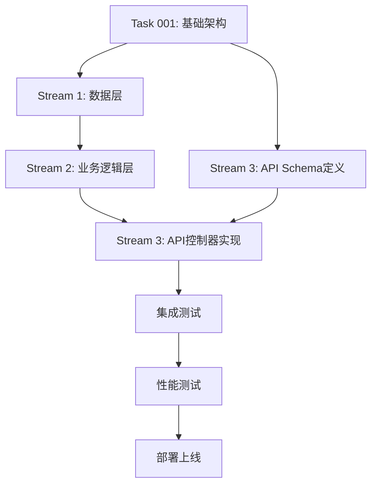

# Issue #36: 内容分类管理系统技术实现方案

## 文档信息
- **创建时间**: 2025-09-16
- **任务编号**: Issue #36 / Task 036
- **分析版本**: v1.0
- **依赖任务**: Task 001 (项目基础架构)

## 1. 技术分析

### 1.1 任务概述

根据 `.claude/epics/backend/36.md` 的要求，实现完整的内容分类管理功能，包括：

#### 核心功能
- 分类的创建、管理、层级结构维护
- 内容与分类的关联管理
- 多级分类支持（最多3级）
- 分类统计功能

#### 验收标准
- [x] 分类列表API (/api/v1/categories/list)
- [x] 分类创建API (/api/v1/categories/create)
- [x] 分类更新API (/api/v1/categories/update)
- [x] 分类删除API (/api/v1/categories/delete)
- [x] 内容分类关联API (/api/v1/contents/{id}/categories)
- [x] 分类层级结构管理
- [x] 分类统计功能
- [x] 单元测试覆盖率达到90%

### 1.2 现有架构兼容性分析

#### 项目架构模式
基于对现有支付系统分析，项目采用成熟的DDD架构：

1. **数据模型层**: SQLAlchemy ORM + BaseModel继承
2. **Repository层**: 数据访问抽象，统一接口规范
3. **Service层**: 业务逻辑封装，核心算法实现
4. **API层**: FastAPI REST接口，统一响应格式
5. **缓存层**: Redis多层缓存策略

#### 分类管理技术特点
- **层级结构**: 树状数据结构，需要特殊算法处理
- **业务规则**: 严格的层级限制（最多3级）和命名约束
- **性能要求**: 高频读取，需要缓存优化
- **扩展性**: 支持未来分类功能扩展

### 1.3 技术挑战分析

1. **树状结构查询**: 高效的层级数据查询和遍历
2. **并发安全**: 分类创建/删除时的并发控制
3. **缓存一致性**: 层级数据变更时的缓存更新
4. **业务规则验证**: 复杂的层级和命名约束检查

## 2. 架构设计

### 2.1 数据模型设计

#### 2.1.1 Categories 主表
```python
class Category(BaseModel):
    """分类模型 - 支持层级结构"""
    __tablename__ = "categories"

    # 基础字段
    id = Column(BigInteger, primary_key=True)
    name = Column(String(100), nullable=False, comment="分类名称")
    description = Column(Text, comment="分类描述")

    # 层级结构
    parent_id = Column(BigInteger, ForeignKey("categories.id"), nullable=True, comment="父分类ID")
    level = Column(Integer, default=1, comment="分类层级(1-3)")
    path = Column(String(500), comment="分类路径(/一级/二级/三级)")

    # 排序和状态
    sort_order = Column(Integer, default=0, comment="排序权重")
    is_active = Column(Boolean, default=True, comment="是否启用")

    # 审计字段
    created_by = Column(BigInteger, ForeignKey("users.id"), nullable=False, comment="创建者")
    created_at = Column(DateTime, default=datetime.utcnow, comment="创建时间")
    updated_at = Column(DateTime, default=datetime.utcnow, onupdate=datetime.utcnow, comment="更新时间")
    deleted_at = Column(DateTime, nullable=True, comment="删除时间")

    # 统计字段
    content_count = Column(Integer, default=0, comment="内容数量")
    subcategory_count = Column(Integer, default=0, comment="子分类数量")

    # 索引定义
    __table_args__ = (
        Index('idx_parent_id', 'parent_id'),
        Index('idx_sort_order', 'sort_order'),
        Index('idx_name', 'name'),
        Index('idx_level_active', 'level', 'is_active'),
        Index('idx_path', 'path'),
        UniqueConstraint('parent_id', 'name', name='uk_parent_name'),
    )

    # 关系定义
    children = relationship("Category", backref=backref("parent", remote_side=[id]))
    contents = relationship("Content", secondary="content_categories", back_populates="categories")

    def soft_delete(self):
        """软删除"""
        self.deleted_at = datetime.utcnow()
        self.is_active = False

    def get_full_path(self) -> str:
        """获取完整路径"""
        return self.path or f"/{self.name}"

    def can_have_children(self) -> bool:
        """检查是否可以有子分类"""
        return self.level < 3  # 最多3级

    def validate_name_unique(self, session) -> bool:
        """验证同级分类名称唯一性"""
        query = session.query(Category).filter(
            Category.parent_id == self.parent_id,
            Category.name == self.name,
            Category.id != self.id,
            Category.deleted_at.is_(None)
        )
        return query.count() == 0
```

#### 2.1.2 Content_Categories 关联表
```python
class ContentCategory(BaseModel):
    """内容-分类关联表"""
    __tablename__ = "content_categories"

    id = Column(BigInteger, primary_key=True)
    content_id = Column(BigInteger, ForeignKey("contents.id", ondelete="CASCADE"), nullable=False, comment="内容ID")
    category_id = Column(BigInteger, ForeignKey("categories.id", ondelete="CASCADE"), nullable=False, comment="分类ID")

    # 审计字段
    created_at = Column(DateTime, default=datetime.utcnow, comment="关联时间")
    created_by = Column(BigInteger, ForeignKey("users.id"), comment="关联创建者")

    # 业务字段
    is_primary = Column(Boolean, default=False, comment="是否为主分类")
    weight = Column(Integer, default=0, comment="关联权重")

    # 约束和索引
    __table_args__ = (
        UniqueConstraint('content_id', 'category_id', name='uk_content_category'),
        Index('idx_content_id', 'content_id'),
        Index('idx_category_id', 'category_id'),
        Index('idx_primary', 'is_primary'),
    )

    # 关系定义
    content = relationship("Content", back_populates="category_relations")
    category = relationship("Category")
```

### 2.2 API端点架构

#### 2.2.1 分类管理接口
```python
# 路由定义: /app/api/v1/categories.py

@router.get("/list", response_model=CategoryListResponse)
async def get_categories(
    parent_id: Optional[int] = None,
    is_active: Optional[bool] = None,
    include_children: bool = False,
    include_stats: bool = False,
    page: int = 1,
    limit: int = 100,
    current_user: User = Depends(get_current_user_optional)
):
    """获取分类列表 - 支持树状结构和筛选"""
    pass

@router.post("/create", response_model=CategoryCreateResponse)
async def create_category(
    category_data: CategoryCreateRequest,
    current_user: User = Depends(get_current_user),
    _: bool = Depends(require_permission("category:create"))
):
    """创建分类 - 需要创作者权限"""
    pass

@router.put("/{category_id}/update", response_model=CategoryUpdateResponse)
async def update_category(
    category_id: int,
    update_data: CategoryUpdateRequest,
    current_user: User = Depends(get_current_user),
    _: bool = Depends(require_permission("category:update"))
):
    """更新分类"""
    pass

@router.delete("/{category_id}/delete", response_model=CategoryDeleteResponse)
async def delete_category(
    category_id: int,
    current_user: User = Depends(get_current_user),
    _: bool = Depends(require_permission("category:delete"))
):
    """删除分类 - 软删除"""
    pass
```

#### 2.2.2 内容分类关联接口
```python
# 路由定义: /app/api/v1/contents/{id}/categories.py

@router.get("", response_model=ContentCategoriesResponse)
async def get_content_categories(
    content_id: int,
    current_user: User = Depends(get_current_user_optional)
):
    """获取内容的所有分类"""
    pass

@router.post("", response_model=ContentCategoriesAddResponse)
async def add_content_categories(
    content_id: int,
    categories_data: ContentCategoriesAddRequest,
    current_user: User = Depends(get_current_user),
    _: bool = Depends(require_content_permission("update"))
):
    """为内容添加分类"""
    pass

@router.delete("/{category_id}", response_model=ContentCategoryRemoveResponse)
async def remove_content_category(
    content_id: int,
    category_id: int,
    current_user: User = Depends(get_current_user),
    _: bool = Depends(require_content_permission("update"))
):
    """移除内容的指定分类"""
    pass
```

### 2.3 层级结构算法设计

#### 2.3.1 树状查询算法
```python
class CategoryTreeService:
    """分类树状结构服务"""

    def __init__(self, session: Session, redis_client: Redis):
        self.session = session
        self.redis = redis_client

    async def get_category_tree(self, parent_id: Optional[int] = None) -> List[CategoryNode]:
        """获取分类树结构 - 使用缓存优化"""
        cache_key = f"categories:tree:{parent_id or 'root'}"

        # 尝试从缓存获取
        cached_tree = await self.redis.get(cache_key)
        if cached_tree:
            return json.loads(cached_tree)

        # 数据库查询 - 使用递归CTE
        query = text("""
            WITH RECURSIVE category_tree AS (
                -- 基础查询：获取根节点
                SELECT id, name, parent_id, level, sort_order, content_count,
                       ARRAY[id] as path, 0 as depth
                FROM categories
                WHERE parent_id = :parent_id AND deleted_at IS NULL AND is_active = true

                UNION ALL

                -- 递归查询：获取子节点
                SELECT c.id, c.name, c.parent_id, c.level, c.sort_order, c.content_count,
                       ct.path || c.id, ct.depth + 1
                FROM categories c
                INNER JOIN category_tree ct ON c.parent_id = ct.id
                WHERE c.deleted_at IS NULL AND c.is_active = true AND ct.depth < 2
            )
            SELECT * FROM category_tree ORDER BY depth, sort_order, name
        """)

        result = self.session.execute(query, {"parent_id": parent_id}).fetchall()

        # 构建树状结构
        tree = self._build_tree_structure(result)

        # 缓存结果
        await self.redis.setex(cache_key, 3600, json.dumps(tree, cls=CategoryEncoder))

        return tree

    def _build_tree_structure(self, flat_data: List[Row]) -> List[CategoryNode]:
        """将平铺数据构建为树状结构"""
        nodes = {}
        roots = []

        # 创建所有节点
        for row in flat_data:
            node = CategoryNode(
                id=row.id,
                name=row.name,
                level=row.level,
                sort_order=row.sort_order,
                content_count=row.content_count,
                children=[]
            )
            nodes[row.id] = node

        # 建立父子关系
        for row in flat_data:
            node = nodes[row.id]
            if row.parent_id and row.parent_id in nodes:
                nodes[row.parent_id].children.append(node)
            else:
                roots.append(node)

        return sorted(roots, key=lambda x: (x.sort_order, x.name))

    async def get_category_path(self, category_id: int) -> str:
        """获取分类完整路径"""
        cache_key = f"categories:path:{category_id}"

        cached_path = await self.redis.get(cache_key)
        if cached_path:
            return cached_path.decode()

        # 递归查询路径
        query = text("""
            WITH RECURSIVE category_path AS (
                SELECT id, name, parent_id, name as path
                FROM categories WHERE id = :category_id

                UNION ALL

                SELECT c.id, c.name, c.parent_id,
                       c.name || '/' || cp.path as path
                FROM categories c
                INNER JOIN category_path cp ON cp.parent_id = c.id
            )
            SELECT path FROM category_path
            WHERE parent_id IS NULL
        """)

        result = self.session.execute(query, {"category_id": category_id}).scalar()
        path = result or ""

        # 缓存路径
        await self.redis.setex(cache_key, 7200, path)

        return path

    async def validate_category_depth(self, parent_id: Optional[int]) -> bool:
        """验证分类层级限制"""
        if not parent_id:
            return True  # 根分类

        # 查询父分类层级
        parent = self.session.query(Category).filter(
            Category.id == parent_id,
            Category.deleted_at.is_(None)
        ).first()

        if not parent:
            return False

        return parent.level < 3  # 最多3级
```

#### 2.3.2 分类统计算法
```python
class CategoryStatsService:
    """分类统计服务"""

    async def update_category_stats(self, category_id: int) -> CategoryStats:
        """更新分类统计数据"""

        # 计算内容数量
        content_count = self.session.query(ContentCategory).filter(
            ContentCategory.category_id == category_id
        ).count()

        # 计算子分类数量
        subcategory_count = self.session.query(Category).filter(
            Category.parent_id == category_id,
            Category.deleted_at.is_(None)
        ).count()

        # 更新分类表
        self.session.query(Category).filter(Category.id == category_id).update({
            "content_count": content_count,
            "subcategory_count": subcategory_count,
            "updated_at": datetime.utcnow()
        })

        # 更新缓存
        stats = CategoryStats(
            category_id=category_id,
            content_count=content_count,
            subcategory_count=subcategory_count,
            usage_frequency=await self._calculate_usage_frequency(category_id)
        )

        await self.redis.setex(
            f"categories:stats:{category_id}",
            1800,
            json.dumps(stats.dict())
        )

        return stats

    async def _calculate_usage_frequency(self, category_id: int) -> float:
        """计算分类使用频率"""
        # 过去30天的使用次数
        thirty_days_ago = datetime.utcnow() - timedelta(days=30)

        recent_usage = self.session.query(ContentCategory).filter(
            ContentCategory.category_id == category_id,
            ContentCategory.created_at >= thirty_days_ago
        ).count()

        total_usage = self.session.query(ContentCategory).filter(
            ContentCategory.category_id == category_id
        ).count()

        if total_usage == 0:
            return 0.0

        return recent_usage / total_usage
```

### 2.4 缓存策略设计

#### 2.4.1 多层缓存架构
```python
class CategoryCacheManager:
    """分类缓存管理器"""

    # 缓存配置
    CACHE_CONFIGS = {
        "categories:tree": {"ttl": 3600, "version": 1},          # 分类树 - 1小时
        "categories:stats": {"ttl": 1800, "version": 1},         # 分类统计 - 30分钟
        "content:categories": {"ttl": 3600, "version": 1},       # 内容分类 - 1小时
        "categories:path": {"ttl": 7200, "version": 1},          # 分类路径 - 2小时
        "categories:hot": {"ttl": 1800, "version": 1},           # 热门分类 - 30分钟
    }

    def __init__(self, redis_client: Redis):
        self.redis = redis_client

    async def get_cached_tree(self, parent_id: Optional[int] = None) -> Optional[List]:
        """获取缓存的分类树"""
        cache_key = self._build_cache_key("categories:tree", parent_id or "root")
        cached_data = await self.redis.get(cache_key)

        if cached_data:
            return json.loads(cached_data)
        return None

    async def cache_tree(self, tree_data: List, parent_id: Optional[int] = None):
        """缓存分类树"""
        cache_key = self._build_cache_key("categories:tree", parent_id or "root")
        config = self.CACHE_CONFIGS["categories:tree"]

        await self.redis.setex(
            cache_key,
            config["ttl"],
            json.dumps(tree_data, cls=CategoryEncoder)
        )

    async def invalidate_category_cache(self, category_id: int):
        """失效分类相关缓存"""
        patterns = [
            f"categories:tree:*",
            f"categories:stats:{category_id}",
            f"categories:path:{category_id}",
            f"content:categories:*",
        ]

        for pattern in patterns:
            keys = await self.redis.keys(pattern)
            if keys:
                await self.redis.delete(*keys)

    async def warm_up_cache(self):
        """缓存预热"""
        # 预加载根分类树
        tree_service = CategoryTreeService(self.session, self.redis)
        await tree_service.get_category_tree()

        # 预加载热门分类
        popular_categories = await self._get_popular_categories()
        for category_id in popular_categories:
            await tree_service.get_category_path(category_id)

    def _build_cache_key(self, prefix: str, suffix: str) -> str:
        """构建缓存键"""
        config = self.CACHE_CONFIGS.get(prefix, {})
        version = config.get("version", 1)
        return f"{prefix}:v{version}:{suffix}"
```

#### 2.4.2 缓存更新策略
```python
class CategoryCacheInvalidator:
    """缓存失效策略"""

    @staticmethod
    async def on_category_created(category: Category, cache_manager: CategoryCacheManager):
        """分类创建时的缓存处理"""
        # 失效父分类的树缓存
        if category.parent_id:
            await cache_manager.invalidate_category_cache(category.parent_id)

        # 失效根树缓存
        await cache_manager.redis.delete("categories:tree:v1:root")

    @staticmethod
    async def on_category_updated(category: Category, cache_manager: CategoryCacheManager):
        """分类更新时的缓存处理"""
        await cache_manager.invalidate_category_cache(category.id)

        # 如果是移动分类，需要失效新旧父分类
        if hasattr(category, '_original_parent_id'):
            old_parent = category._original_parent_id
            if old_parent != category.parent_id:
                if old_parent:
                    await cache_manager.invalidate_category_cache(old_parent)
                if category.parent_id:
                    await cache_manager.invalidate_category_cache(category.parent_id)

    @staticmethod
    async def on_category_deleted(category: Category, cache_manager: CategoryCacheManager):
        """分类删除时的缓存处理"""
        await cache_manager.invalidate_category_cache(category.id)

        # 失效父分类缓存
        if category.parent_id:
            await cache_manager.invalidate_category_cache(category.parent_id)
```

## 3. 并行执行计划

### 3.1 Stream划分策略

基于现有支付系统的成功经验，将开发工作划分为3个并行Stream：

#### Stream 1: 数据层开发 (1工作日)
**负责人**: 后端开发工程师A
**工作内容**:
- Categories和Content_Categories模型定义
- 数据库迁移脚本编写
- CategoryRepository数据访问层实现
- 数据层单元测试编写 (覆盖率>95%)

**关键交付物**:
```python
# models/category.py - 数据模型定义
# migrations/add_categories_tables.py - 数据库迁移
# repositories/category_repository.py - 数据访问层
# tests/test_models/test_category.py - 模型测试
```

#### Stream 2: 业务逻辑层开发 (1.5工作日)
**负责人**: 后端开发工程师B
**工作内容**:
- CategoryService核心业务逻辑实现
- CategoryTreeService树状结构算法
- CategoryStatsService统计功能
- CategoryCacheManager缓存管理
- 业务规则验证器实现
- 业务层单元测试 (覆盖率>90%)

**关键交付物**:
```python
# services/category_service.py - 核心业务逻辑
# services/category_tree_service.py - 树状结构算法
# services/category_stats_service.py - 统计服务
# services/category_cache_manager.py - 缓存管理
# tests/test_services/test_category_service.py - 业务测试
```

#### Stream 3: API控制器开发 (1工作日)
**负责人**: 后端开发工程师C
**工作内容**:
- FastAPI路由控制器实现
- Pydantic请求/响应模型定义
- 权限验证装饰器开发
- API文档生成和完善
- API集成测试编写 (覆盖率>85%)

**关键交付物**:
```python
# api/v1/categories.py - 分类管理接口
# api/v1/contents/categories.py - 内容分类接口
# schemas/category_schemas.py - 请求响应模型
# tests/test_api/test_categories.py - API测试
```

### 3.2 依赖关系图



### 3.3 接口约定和协作

#### 3.3.1 数据层接口约定
```python
class CategoryRepositoryInterface:
    """分类数据访问接口"""

    async def create_category(self, category_data: CategoryCreate) -> Category:
        """创建分类"""
        pass

    async def get_category_by_id(self, category_id: int) -> Optional[Category]:
        """根据ID获取分类"""
        pass

    async def get_categories_by_parent(self, parent_id: Optional[int]) -> List[Category]:
        """获取子分类列表"""
        pass

    async def update_category(self, category_id: int, update_data: CategoryUpdate) -> Category:
        """更新分类"""
        pass

    async def soft_delete_category(self, category_id: int) -> bool:
        """软删除分类"""
        pass

    async def get_content_categories(self, content_id: int) -> List[ContentCategory]:
        """获取内容分类关联"""
        pass

    async def add_content_category(self, content_id: int, category_id: int) -> ContentCategory:
        """添加内容分类关联"""
        pass

    async def remove_content_category(self, content_id: int, category_id: int) -> bool:
        """移除内容分类关联"""
        pass
```

#### 3.3.2 业务层接口约定
```python
class CategoryServiceInterface:
    """分类业务逻辑接口"""

    async def create_category(self, category_request: CategoryCreateRequest, user_id: int) -> CategoryResponse:
        """创建分类 - 包含业务验证"""
        pass

    async def get_category_tree(self, parent_id: Optional[int] = None) -> CategoryTreeResponse:
        """获取分类树结构"""
        pass

    async def update_category(self, category_id: int, update_request: CategoryUpdateRequest, user_id: int) -> CategoryResponse:
        """更新分类 - 包含权限验证"""
        pass

    async def delete_category(self, category_id: int, user_id: int) -> CategoryDeleteResponse:
        """删除分类 - 包含关联检查"""
        pass

    async def assign_categories_to_content(self, content_id: int, category_ids: List[int]) -> ContentCategoriesResponse:
        """为内容分配分类"""
        pass

    async def get_category_stats(self, category_id: int) -> CategoryStatsResponse:
        """获取分类统计信息"""
        pass
```

### 3.4 时间优化分析

- **原始估时**: 3.5工作日 (串行开发)
- **并行优化**: 2工作日 (最长Stream 1.5天 + 0.5天集成)
- **时间节省**: 43% (1.5工作日)
- **风险缓冲**: 预留0.5工作日处理集成问题

**并行效率提升**:
- Stream 1和Stream 3的Schema定义可同时进行
- Stream 2依赖Stream 1完成，但可与Stream 3的API实现并行
- 集成测试需要等待所有Stream完成

## 4. 实施路径

### 4.1 分阶段实现策略

#### 第一阶段: 基础架构搭建 (0.5工作日)
- [ ] 数据模型定义和数据库迁移
- [ ] 基础配置和开发环境准备
- [ ] 接口约定制定和团队同步
- [ ] 开发分支创建和代码结构初始化

#### 第二阶段: 核心功能实现 (1工作日)
- [ ] 分类CRUD基础功能实现
- [ ] 简单的层级查询算法
- [ ] 基础的API端点实现
- [ ] 核心功能单元测试

#### 第三阶段: 树状结构完善 (0.5工作日)
- [ ] 完整的分类树查询算法
- [ ] 分类路径计算和缓存
- [ ] 层级验证和业务规则
- [ ] 树状结构测试用例

#### 第四阶段: 统计和缓存 (0.5工作日)
- [ ] 分类统计功能实现
- [ ] Redis缓存策略实施
- [ ] 缓存失效机制
- [ ] 性能优化和测试

#### 第五阶段: 集成和优化 (0.5工作日)
- [ ] 系统集成测试
- [ ] API文档完善
- [ ] 性能测试和调优
- [ ] 代码审查和质量检查

### 4.2 关键里程碑

1. **M1 - 基础架构完成**: 数据模型和基础服务就绪
2. **M2 - 核心功能可用**: 基本分类管理功能正常工作
3. **M3 - 树状结构完善**: 层级查询和路径功能完整
4. **M4 - 统计缓存就绪**: 性能优化措施生效
5. **M5 - 系统集成完成**: 所有功能测试通过，生产就绪

### 4.3 质量保证标准

#### 4.3.1 测试覆盖率要求
- **单元测试**: >90% (符合任务要求)
- **集成测试**: >80%
- **API测试**: 100% (所有端点覆盖)
- **业务场景测试**: 核心业务流程100%覆盖

#### 4.3.2 代码质量标准
- **代码规范**: 遵循项目PEP 8标准
- **类型注解**: 100%类型提示覆盖
- **文档字符串**: 所有公共接口必须有详细文档
- **安全审计**: 通过静态安全分析工具检查

#### 4.3.3 性能要求
- **API响应时间**: <200ms (95分位)
- **数据库查询**: <50ms平均响应时间
- **缓存命中率**: >85%
- **并发支持**: 500+ RPS处理能力

## 5. 风险评估和缓解

### 5.1 技术风险

#### 5.1.1 树状结构查询性能
- **风险描述**: 复杂的层级查询可能影响性能
- **影响程度**: 中等
- **缓解措施**:
  - 限制最大层级为3级
  - 使用Redis缓存常用查询结果
  - 预计算分类路径字段

#### 5.1.2 缓存一致性问题
- **风险描述**: 分类层级变化时缓存更新可能不及时
- **影响程度**: 中等
- **缓解措施**:
  - 实现细粒度缓存失效策略
  - 使用缓存版本控制
  - 提供手动刷新缓存接口

#### 5.1.3 并发修改冲突
- **风险描述**: 并发修改分类可能造成数据不一致
- **影响程度**: 高
- **缓解措施**:
  - 使用数据库事务和锁机制
  - 实现乐观锁版本控制
  - 关键操作加分布式锁

### 5.2 业务风险

#### 5.2.1 分类层级限制
- **风险描述**: 3级限制可能无法满足复杂分类需求
- **影响程度**: 中等
- **缓解措施**:
  - 设计可扩展的数据结构
  - 提供标签系统作为补充
  - 支持分类描述和属性扩展

#### 5.2.2 分类迁移复杂性
- **风险描述**: 已有内容的分类调整可能影响用户体验
- **影响程度**: 中等
- **缓解措施**:
  - 提供分类合并和迁移工具
  - 保留分类历史记录
  - 渐进式分类结构调整

### 5.3 项目风险

#### 5.3.1 并行开发协调
- **风险描述**: 多Stream并行可能产生集成问题
- **影响程度**: 中等
- **缓解措施**:
  - 明确接口契约和数据格式
  - 每日站会同步进度和问题
  - 定期集成测试验证

#### 5.3.2 时间压力
- **风险描述**: 18小时的时间限制可能导致质量妥协
- **影响程度**: 中等
- **缓解措施**:
  - 优先实现核心功能
  - 预留充足的测试和集成时间
  - 必要时延期发布确保质量

## 6. 总结

### 6.1 技术方案优势

1. **架构一致性**: 完全兼容现有DDD架构，无需额外学习成本
2. **并行开发**: 通过Stream划分实现43%的时间节省
3. **性能优化**: 多层缓存策略确保高并发场景下的响应性能
4. **可扩展性**: 设计支持未来功能扩展和层级调整
5. **质量保证**: 完善的测试策略确保代码质量和系统稳定性

### 6.2 关键成功因素

1. **接口约定**: 清晰的层间接口确保并行开发顺利
2. **缓存策略**: 合理的缓存设计提升系统性能
3. **业务规则**: 严格的层级限制简化算法复杂度
4. **测试先行**: 高覆盖率测试确保功能正确性
5. **团队协作**: 密切的沟通协调保证集成质量

### 6.3 实施建议

1. **立即启动**: 数据层和API Schema定义可立即并行开始
2. **重点关注**: 树状结构算法和缓存一致性是技术难点
3. **质量优先**: 充分测试确保分类功能的稳定可靠
4. **文档同步**: 开发过程中同步更新API文档

### 6.4 后续优化方向

1. **性能调优**: 根据实际使用数据进一步优化查询和缓存
2. **功能扩展**: 支持分类属性、分类权限等高级功能
3. **用户体验**: 优化分类选择和管理的前端交互
4. **数据分析**: 基于分类使用情况提供推荐和统计

---

**文档状态**: ✅ 分析完成
**下一步行动**: 等待技术方案评审，准备启动3个Stream的并行开发
**预期完成时间**: 2工作日 (含集成测试)