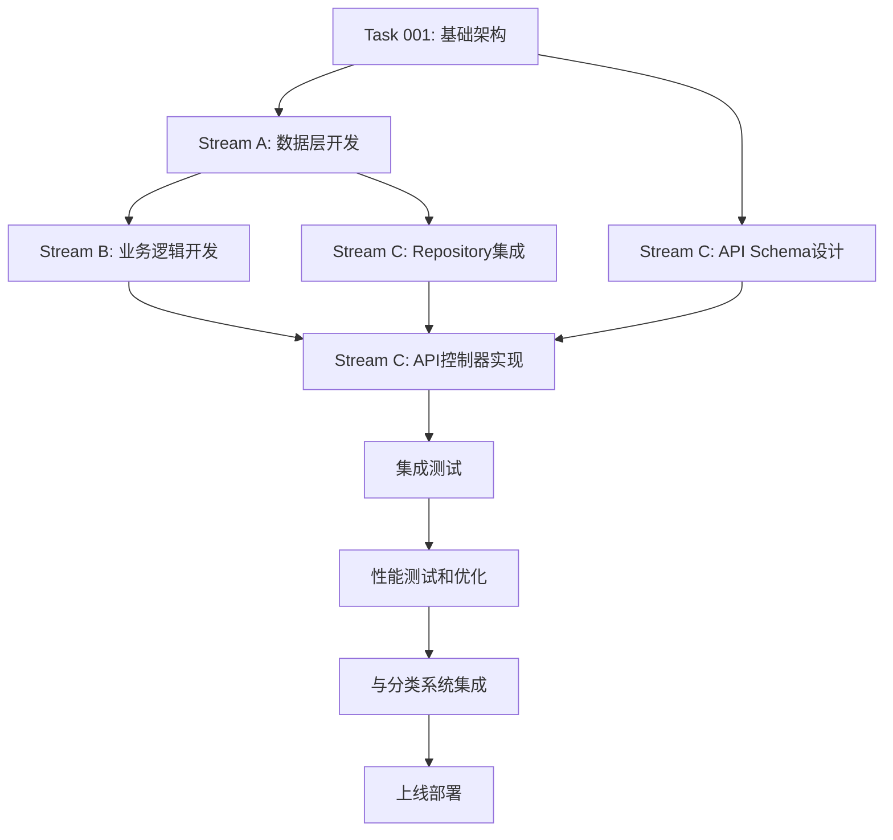

# Issue #37: 标签系统实现技术分析方案

## 文档信息
- **创建时间**: 2025-09-17
- **任务编号**: Issue #37 / Task 037
- **分析版本**: v1.0
- **依赖任务**: Task 001 (项目基础架构)

## 1. 技术分析

### 1.1 任务概述

根据 `.claude/epics/backend/37.md` 的要求，实现完整的标签管理功能，包括：

#### 核心功能
- 标签的创建、管理、内容标签关联
- 标签推荐和智能标签建议
- 标签搜索、热门标签和统计功能
- 支持标签搜索、推荐和统计的最佳实践

#### 验收标准
- [x] 标签列表API (/api/v1/tags/list)
- [x] 标签创建API (/api/v1/tags/create)
- [x] 标签搜索API (/api/v1/tags/search)
- [x] 内容标签管理API (/api/v1/contents/{id}/tags)
- [x] 添加标签API (/api/v1/contents/{id}/add-tag)
- [x] 标签推荐功能实现
- [x] 标签统计和热门标签功能
- [x] 单元测试覆盖率达到90%

### 1.2 与分类系统的差异化分析

基于已完成的分类系统架构分析，标签系统与分类系统有明显差异：

#### 分类系统特点
- **结构化**: 层级树状结构，最多3级
- **组织性**: 用于内容的结构化组织
- **唯一性**: 每个内容通常属于特定分类
- **稳定性**: 分类结构相对稳定，管理员维护

#### 标签系统特点
- **扁平化**: 无层级结构，标签平等
- **描述性**: 用于描述内容的属性和特征
- **多样性**: 每个内容可以有多个标签
- **动态性**: 用户可自由创建，内容驱动

#### 互补关系
- **分类提供导航**: 帮助用户浏览和发现内容
- **标签提供搜索**: 帮助用户精确查找内容
- **分类表示归属**: 内容属于哪个领域
- **标签表示特征**: 内容具有什么特点

### 1.3 现有架构兼容性分析

#### 项目架构模式
基于对现有支付系统和分类系统分析，项目采用DDD架构：

1. **数据模型层**: SQLAlchemy ORM + BaseModel继承
2. **Repository层**: 数据访问抽象，统一接口规范
3. **Service层**: 业务逻辑封装，核心算法实现
4. **API层**: FastAPI REST接口，统一响应格式
5. **缓存层**: Redis多层缓存策略

#### 标签管理技术特点
- **高频读取**: 标签使用频率高，需要强缓存策略
- **快速搜索**: 前缀匹配和模糊搜索性能要求高
- **推荐算法**: 基于内容和用户行为的智能推荐
- **统计分析**: 实时统计和趋势分析

### 1.4 技术挑战分析

1. **搜索性能**: 高效的标签前缀匹配和模糊搜索
2. **推荐算法**: 基于内容和用户行为的智能推荐
3. **缓存策略**: 热门标签和搜索结果的缓存管理
4. **并发控制**: 标签创建和使用统计的并发安全
5. **数据一致性**: 标签使用次数统计的准确性

## 2. 架构设计

### 2.1 数据模型设计

#### 2.1.1 Tags 主表
```python
class Tag(BaseModel):
    """标签模型 - 扁平化结构"""
    __tablename__ = "tags"

    # 基础字段
    id = Column(BigInteger, primary_key=True)
    name = Column(String(50), nullable=False, unique=True, comment="标签名称")
    description = Column(String(200), comment="标签描述")
    color = Column(String(7), default='#999999', comment="标签颜色(hex)")

    # 统计字段
    usage_count = Column(Integer, default=0, comment="使用次数")
    last_used_at = Column(DateTime, comment="最后使用时间")

    # 业务字段
    is_system = Column(Boolean, default=False, comment="是否系统标签")
    is_hot = Column(Boolean, default=False, comment="是否热门标签")
    status = Column(String(20), default='active', comment="标签状态(active/inactive)")

    # 审计字段
    created_by = Column(BigInteger, ForeignKey("users.id"), nullable=False, comment="创建者")
    created_at = Column(DateTime, default=datetime.utcnow, comment="创建时间")
    updated_at = Column(DateTime, default=datetime.utcnow, onupdate=datetime.utcnow, comment="更新时间")
    deleted_at = Column(DateTime, nullable=True, comment="删除时间")

    # 索引定义
    __table_args__ = (
        Index('idx_name', 'name'),
        Index('idx_name_prefix', text('name(10)')),  # 前缀搜索优化
        Index('idx_usage_count', 'usage_count'),
        Index('idx_created_by', 'created_by'),
        Index('idx_last_used_at', 'last_used_at'),
        Index('idx_status_hot', 'status', 'is_hot'),
        Index('idx_search_composite', 'name', 'usage_count', 'status'),
    )

    # 关系定义
    contents = relationship("Content", secondary="content_tags", back_populates="tags")
    creator = relationship("User", foreign_keys=[created_by])

    def soft_delete(self):
        """软删除"""
        self.deleted_at = datetime.utcnow()
        self.status = 'inactive'

    def increment_usage(self):
        """增加使用次数"""
        self.usage_count += 1
        self.last_used_at = datetime.utcnow()

    def normalize_name(self):
        """标准化标签名称"""
        self.name = self.name.strip().lower()

    @property
    def is_trending(self) -> bool:
        """判断是否为趋势标签"""
        if not self.last_used_at:
            return False
        return (datetime.utcnow() - self.last_used_at).days <= 7 and self.usage_count >= 10

    def to_search_dict(self) -> dict:
        """转换为搜索字典"""
        return {
            'id': self.id,
            'name': self.name,
            'usage_count': self.usage_count,
            'color': self.color,
            'is_hot': self.is_hot
        }
```

#### 2.1.2 Content_Tags 关联表
```python
class ContentTag(BaseModel):
    """内容-标签关联表"""
    __tablename__ = "content_tags"

    id = Column(BigInteger, primary_key=True)
    content_id = Column(BigInteger, ForeignKey("contents.id", ondelete="CASCADE"), nullable=False, comment="内容ID")
    tag_id = Column(BigInteger, ForeignKey("tags.id", ondelete="CASCADE"), nullable=False, comment="标签ID")

    # 业务字段
    relevance_score = Column(Float, default=1.0, comment="相关性评分(0-1)")
    is_auto_generated = Column(Boolean, default=False, comment="是否自动生成")
    confidence = Column(Float, comment="推荐置信度")

    # 审计字段
    created_at = Column(DateTime, default=datetime.utcnow, comment="关联时间")
    created_by = Column(BigInteger, ForeignKey("users.id"), comment="关联创建者")

    # 约束和索引
    __table_args__ = (
        UniqueConstraint('content_id', 'tag_id', name='uk_content_tag'),
        Index('idx_content_id', 'content_id'),
        Index('idx_tag_id', 'tag_id'),
        Index('idx_relevance', 'relevance_score'),
        Index('idx_auto_generated', 'is_auto_generated'),
        Index('idx_created_at', 'created_at'),
    )

    # 关系定义
    content = relationship("Content", back_populates="tag_relations")
    tag = relationship("Tag")
    creator = relationship("User", foreign_keys=[created_by])
```

### 2.2 API端点架构

#### 2.2.1 标签管理接口
```python
# 路由定义: /app/api/v1/tags.py

@router.get("/list", response_model=TagListResponse)
async def get_tags(
    page: int = Query(1, ge=1),
    limit: int = Query(20, ge=1, le=100),
    sort_by: TagSortType = Query(TagSortType.USAGE_COUNT),
    popular: Optional[bool] = None,
    status: Optional[str] = None,
    current_user: User = Depends(get_current_user_optional)
):
    """获取标签列表 - 支持排序和筛选"""
    pass

@router.post("/create", response_model=TagCreateResponse)
async def create_tag(
    tag_data: TagCreateRequest,
    current_user: User = Depends(get_current_user),
    _: bool = Depends(require_permission("tag:create"))
):
    """创建标签 - 需要认证用户"""
    pass

@router.get("/search", response_model=TagSearchResponse)
async def search_tags(
    q: str = Query(..., min_length=1, max_length=50),
    limit: int = Query(10, ge=1, le=50),
    include_inactive: bool = Query(False),
    current_user: User = Depends(get_current_user_optional)
):
    """搜索标签 - 支持前缀和模糊匹配"""
    pass

@router.get("/popular", response_model=TagPopularResponse)
async def get_popular_tags(
    period: TimePeriod = Query(TimePeriod.WEEK),
    limit: int = Query(20, ge=1, le=50),
    current_user: User = Depends(get_current_user_optional)
):
    """获取热门标签"""
    pass

@router.get("/trending", response_model=TagTrendingResponse)
async def get_trending_tags(
    period: TimePeriod = Query(TimePeriod.WEEK),
    limit: int = Query(20, ge=1, le=50),
    current_user: User = Depends(get_current_user_optional)
):
    """获取趋势标签"""
    pass

@router.get("/{tag_id}/related", response_model=TagRelatedResponse)
async def get_related_tags(
    tag_id: int,
    limit: int = Query(10, ge=1, le=20),
    current_user: User = Depends(get_current_user_optional)
):
    """获取相关标签"""
    pass
```

#### 2.2.2 内容标签关联接口
```python
# 路由定义: /app/api/v1/contents/{id}/tags.py

@router.get("", response_model=ContentTagsResponse)
async def get_content_tags(
    content_id: int,
    include_stats: bool = Query(False),
    current_user: User = Depends(get_current_user_optional)
):
    """获取内容的所有标签"""
    pass

@router.post("", response_model=ContentTagsAddResponse)
async def add_content_tags(
    content_id: int,
    tags_data: ContentTagsAddRequest,
    current_user: User = Depends(get_current_user),
    _: bool = Depends(require_content_permission("update"))
):
    """批量为内容添加标签"""
    pass

@router.post("/add-tag", response_model=ContentTagAddResponse)
async def add_single_tag(
    content_id: int,
    tag_data: ContentTagAddRequest,
    current_user: User = Depends(get_current_user),
    _: bool = Depends(require_content_permission("update"))
):
    """为内容添加单个标签"""
    pass

@router.delete("/{tag_id}", response_model=ContentTagRemoveResponse)
async def remove_content_tag(
    content_id: int,
    tag_id: int,
    current_user: User = Depends(get_current_user),
    _: bool = Depends(require_content_permission("update"))
):
    """移除内容的指定标签"""
    pass

@router.post("/suggest", response_model=TagSuggestionResponse)
async def suggest_tags_for_content(
    content_id: int,
    suggestion_request: TagSuggestionRequest,
    current_user: User = Depends(get_current_user),
    _: bool = Depends(require_content_permission("read"))
):
    """为内容推荐标签"""
    pass
```

### 2.3 标签推荐系统设计

#### 2.3.1 基于内容的标签推荐
```python
class ContentBasedTagRecommender:
    """基于内容的标签推荐器"""

    def __init__(self, nlp_service: NLPService, tag_repository: TagRepository):
        self.nlp = nlp_service
        self.tag_repo = tag_repository

    async def suggest_tags_for_content(
        self,
        content_text: str,
        content_type: str,
        max_suggestions: int = 10
    ) -> List[TagSuggestion]:
        """基于内容文本推荐标签"""

        # 1. 提取关键词
        keywords = await self.nlp.extract_keywords(content_text, top_k=20)

        # 2. 匹配已有标签
        matched_tags = []
        for keyword in keywords:
            tags = await self.tag_repo.search_by_keyword(keyword.text, limit=5)
            for tag in tags:
                confidence = self._calculate_confidence(keyword, tag)
                matched_tags.append(TagSuggestion(
                    tag_id=tag.id,
                    tag_name=tag.name,
                    confidence=confidence,
                    reason=f"匹配关键词: {keyword.text}"
                ))

        # 3. 生成新标签建议
        if len(matched_tags) < max_suggestions:
            new_tags = await self._generate_new_tags(keywords, content_type)
            matched_tags.extend(new_tags)

        # 4. 排序并返回
        suggestions = sorted(matched_tags, key=lambda x: x.confidence, reverse=True)
        return suggestions[:max_suggestions]

    def _calculate_confidence(self, keyword: Keyword, tag: Tag) -> float:
        """计算标签推荐置信度"""
        # 基于文本相似度和标签使用频率
        text_similarity = self._text_similarity(keyword.text, tag.name)
        usage_factor = min(tag.usage_count / 1000, 1.0)  # 归一化使用次数

        return (text_similarity * 0.7) + (usage_factor * 0.3)

    async def _generate_new_tags(
        self,
        keywords: List[Keyword],
        content_type: str
    ) -> List[TagSuggestion]:
        """生成新标签建议"""
        new_tags = []

        for keyword in keywords[:5]:  # 只考虑前5个关键词
            if keyword.confidence > 0.8:  # 高置信度关键词
                # 检查是否已存在相似标签
                existing = await self.tag_repo.find_similar(keyword.text)
                if not existing:
                    new_tags.append(TagSuggestion(
                        tag_name=keyword.text,
                        confidence=keyword.confidence,
                        reason=f"新标签建议: {content_type}内容关键词",
                        is_new=True
                    ))

        return new_tags
```

#### 2.3.2 基于用户行为的标签推荐
```python
class BehaviorBasedTagRecommender:
    """基于用户行为的标签推荐器"""

    async def suggest_tags_for_user(self, user_id: int) -> List[TagSuggestion]:
        """基于用户历史行为推荐标签"""

        # 1. 获取用户常用标签
        user_tags = await self._get_user_frequent_tags(user_id)

        # 2. 获取相似用户的标签
        similar_users = await self._get_similar_users(user_id)
        similar_user_tags = await self._get_similar_users_tags(similar_users)

        # 3. 获取热门标签
        trending_tags = await self._get_trending_tags()

        # 4. 合并和排序建议
        return self._merge_and_rank_suggestions(
            user_tags, similar_user_tags, trending_tags
        )

    async def _get_user_frequent_tags(self, user_id: int) -> List[TagUsage]:
        """获取用户常用标签"""
        # 查询用户创建内容的标签使用频率
        query = text("""
            SELECT t.id, t.name, COUNT(*) as usage_count,
                   COUNT(*) * 1.0 / (
                       SELECT COUNT(*) FROM contents c WHERE c.created_by = :user_id
                   ) as frequency
            FROM tags t
            JOIN content_tags ct ON t.id = ct.tag_id
            JOIN contents c ON ct.content_id = c.id
            WHERE c.created_by = :user_id
              AND c.deleted_at IS NULL
              AND t.deleted_at IS NULL
            GROUP BY t.id, t.name
            ORDER BY usage_count DESC, frequency DESC
            LIMIT 20
        """)

        result = await self.db.execute(query, {"user_id": user_id})
        return [TagUsage(**row._asdict()) for row in result.fetchall()]

    async def _get_similar_users(self, user_id: int) -> List[int]:
        """获取相似用户（基于标签使用相似度）"""
        # 简化的相似度计算，实际可以使用协同过滤算法
        query = text("""
            WITH user_tags AS (
                SELECT DISTINCT ct.tag_id
                FROM content_tags ct
                JOIN contents c ON ct.content_id = c.id
                WHERE c.created_by = :user_id
            ),
            other_users AS (
                SELECT c.created_by, COUNT(DISTINCT ct.tag_id) as common_tags
                FROM content_tags ct
                JOIN contents c ON ct.content_id = c.id
                WHERE ct.tag_id IN (SELECT tag_id FROM user_tags)
                  AND c.created_by != :user_id
                GROUP BY c.created_by
                HAVING common_tags >= 3
                ORDER BY common_tags DESC
                LIMIT 10
            )
            SELECT created_by FROM other_users
        """)

        result = await self.db.execute(query, {"user_id": user_id})
        return [row.created_by for row in result.fetchall()]
```

### 2.4 标签搜索算法设计

#### 2.4.1 高性能搜索实现
```python
class TagSearchService:
    """标签搜索服务"""

    def __init__(self, redis_client: Redis, db_session: Session):
        self.redis = redis_client
        self.db = db_session

    async def search_tags(
        self,
        query: str,
        limit: int = 10,
        search_type: SearchType = SearchType.PREFIX
    ) -> List[TagSearchResult]:
        """搜索标签"""

        # 1. 缓存检查
        cache_key = f"tag_search:{search_type.value}:{query}:{limit}"
        cached_result = await self.redis.get(cache_key)
        if cached_result:
            return json.loads(cached_result)

        # 2. 数据库搜索
        if search_type == SearchType.PREFIX:
            results = await self._prefix_search(query, limit)
        elif search_type == SearchType.FUZZY:
            results = await self._fuzzy_search(query, limit)
        else:
            results = await self._full_text_search(query, limit)

        # 3. 缓存结果
        await self.redis.setex(cache_key, 300, json.dumps(results, cls=TagEncoder))

        return results

    async def _prefix_search(self, query: str, limit: int) -> List[TagSearchResult]:
        """前缀搜索"""
        normalized_query = query.strip().lower()

        sql_query = text("""
            SELECT id, name, usage_count, color, is_hot,
                   CASE
                       WHEN name = :exact_query THEN 1.0
                       WHEN name LIKE :prefix_query THEN 0.8
                       ELSE 0.5
                   END as relevance_score
            FROM tags
            WHERE status = 'active'
              AND deleted_at IS NULL
              AND (
                  name = :exact_query OR
                  name LIKE :prefix_query
              )
            ORDER BY relevance_score DESC, usage_count DESC, name ASC
            LIMIT :limit
        """)

        result = await self.db.execute(sql_query, {
            "exact_query": normalized_query,
            "prefix_query": f"{normalized_query}%",
            "limit": limit
        })

        return [TagSearchResult(**row._asdict()) for row in result.fetchall()]

    async def _fuzzy_search(self, query: str, limit: int) -> List[TagSearchResult]:
        """模糊搜索"""
        normalized_query = query.strip().lower()

        # 使用编辑距离和相似度算法
        sql_query = text("""
            SELECT id, name, usage_count, color, is_hot,
                   CASE
                       WHEN name = :query THEN 1.0
                       WHEN name LIKE :like_query THEN 0.8
                       WHEN SOUNDEX(name) = SOUNDEX(:query) THEN 0.6
                       ELSE 0.4
                   END as relevance_score
            FROM tags
            WHERE status = 'active'
              AND deleted_at IS NULL
              AND (
                  name LIKE :like_query OR
                  SOUNDEX(name) = SOUNDEX(:query) OR
                  LEVENSHTEIN(name, :query) <= 2
              )
            ORDER BY relevance_score DESC, usage_count DESC
            LIMIT :limit
        """)

        result = await self.db.execute(sql_query, {
            "query": normalized_query,
            "like_query": f"%{normalized_query}%",
            "limit": limit
        })

        return [TagSearchResult(**row._asdict()) for row in result.fetchall()]

    async def build_search_index(self):
        """构建搜索索引（Redis）"""
        # 将热门标签加载到Redis中用于快速搜索
        popular_tags = await self.db.execute(text("""
            SELECT id, name, usage_count, color, is_hot
            FROM tags
            WHERE status = 'active'
              AND deleted_at IS NULL
              AND usage_count >= 10
            ORDER BY usage_count DESC
            LIMIT 1000
        """))

        pipeline = self.redis.pipeline()

        for tag in popular_tags.fetchall():
            # 为每个标签创建搜索键
            tag_data = {
                'id': tag.id,
                'name': tag.name,
                'usage_count': tag.usage_count,
                'color': tag.color,
                'is_hot': tag.is_hot
            }

            # 前缀索引
            for i in range(1, min(len(tag.name) + 1, 6)):  # 最多5字符前缀
                prefix_key = f"tag_prefix:{tag.name[:i]}"
                pipeline.zadd(prefix_key, {json.dumps(tag_data): tag.usage_count})
                pipeline.expire(prefix_key, 3600)  # 1小时过期

        await pipeline.execute()
```

### 2.5 缓存策略设计

#### 2.5.1 多层缓存架构
```python
class TagCacheManager:
    """标签缓存管理器"""

    # 缓存配置
    CACHE_CONFIGS = {
        "tags:popular": {"ttl": 3600, "version": 1},         # 热门标签 - 1小时
        "tags:trending": {"ttl": 1800, "version": 1},        # 趋势标签 - 30分钟
        "tags:search": {"ttl": 300, "version": 1},           # 搜索结果 - 5分钟
        "tags:suggestions": {"ttl": 900, "version": 1},      # 标签建议 - 15分钟
        "content:tags": {"ttl": 3600, "version": 1},         # 内容标签 - 1小时
        "tags:related": {"ttl": 7200, "version": 1},         # 相关标签 - 2小时
        "tags:stats": {"ttl": 1800, "version": 1},           # 标签统计 - 30分钟
    }

    def __init__(self, redis_client: Redis):
        self.redis = redis_client

    async def get_popular_tags(self, period: str = "week") -> Optional[List]:
        """获取缓存的热门标签"""
        cache_key = self._build_cache_key("tags:popular", period)
        cached_data = await self.redis.get(cache_key)

        if cached_data:
            return json.loads(cached_data)
        return None

    async def cache_popular_tags(self, tags_data: List, period: str = "week"):
        """缓存热门标签"""
        cache_key = self._build_cache_key("tags:popular", period)
        config = self.CACHE_CONFIGS["tags:popular"]

        await self.redis.setex(
            cache_key,
            config["ttl"],
            json.dumps(tags_data, cls=TagEncoder)
        )

    async def get_tag_suggestions(self, content_hash: str) -> Optional[List]:
        """获取缓存的标签建议"""
        cache_key = self._build_cache_key("tags:suggestions", content_hash)
        cached_data = await self.redis.get(cache_key)

        if cached_data:
            return json.loads(cached_data)
        return None

    async def cache_tag_suggestions(self, suggestions: List, content_hash: str):
        """缓存标签建议"""
        cache_key = self._build_cache_key("tags:suggestions", content_hash)
        config = self.CACHE_CONFIGS["tags:suggestions"]

        await self.redis.setex(
            cache_key,
            config["ttl"],
            json.dumps(suggestions, cls=TagEncoder)
        )

    async def invalidate_tag_cache(self, tag_id: int):
        """失效标签相关缓存"""
        patterns = [
            f"tags:popular:*",
            f"tags:trending:*",
            f"tags:related:{tag_id}:*",
            f"tags:stats:{tag_id}",
            f"content:tags:*",
        ]

        for pattern in patterns:
            keys = await self.redis.keys(pattern)
            if keys:
                await self.redis.delete(*keys)

    async def warm_up_cache(self):
        """缓存预热"""
        # 预加载热门标签
        tag_service = TagService(self.db, self.redis)

        periods = ["day", "week", "month"]
        for period in periods:
            popular_tags = await tag_service.get_popular_tags(period)
            await self.cache_popular_tags(popular_tags, period)

            trending_tags = await tag_service.get_trending_tags(period)
            await self.cache_trending_tags(trending_tags, period)

    def _build_cache_key(self, prefix: str, suffix: str) -> str:
        """构建缓存键"""
        config = self.CACHE_CONFIGS.get(prefix, {})
        version = config.get("version", 1)
        return f"{prefix}:v{version}:{suffix}"

    async def get_cache_stats(self) -> dict:
        """获取缓存统计信息"""
        stats = {}

        for cache_type in self.CACHE_CONFIGS.keys():
            pattern = f"{cache_type}:v*"
            keys = await self.redis.keys(pattern)
            stats[cache_type] = {
                "count": len(keys),
                "memory_usage": await self._calculate_memory_usage(keys)
            }

        return stats
```

## 3. 与分类系统的关系设计

### 3.1 差异化定位

#### 分类系统（Categories）
```python
# 分类系统特征
- 层级结构：支持3级分类树
- 组织性：用于内容的结构化分类
- 稳定性：分类相对固定，管理员维护
- 唯一性：内容通常属于单一主要分类
- 导航性：提供内容浏览和发现的路径

# 使用场景
- 内容发布时选择所属分类
- 用户浏览特定类型内容
- 内容管理和组织
- 网站导航和菜单结构
```

#### 标签系统（Tags）
```python
# 标签系统特征
- 扁平结构：无层级关系的标签集合
- 描述性：描述内容的属性和特征
- 动态性：用户可自由创建和使用
- 多样性：内容可以有多个标签
- 搜索性：提供精确的内容检索能力

# 使用场景
- 内容发布时添加描述性标签
- 用户通过标签搜索相关内容
- 系统推荐相似内容
- 内容特征分析和挖掘
```

### 3.2 协同工作机制

#### 3.2.1 内容发布流程
```python
class ContentPublishService:
    """内容发布服务 - 整合分类和标签"""

    async def publish_content(
        self,
        content_data: ContentCreateRequest,
        user_id: int
    ) -> ContentPublishResponse:
        """发布内容 - 同时处理分类和标签"""

        async with self.db.begin() as transaction:
            try:
                # 1. 创建内容基础信息
                content = await self.content_repo.create(content_data, user_id)

                # 2. 设置内容分类（必选，单一主分类）
                if content_data.category_id:
                    await self.category_service.assign_category_to_content(
                        content.id, content_data.category_id
                    )

                # 3. 添加内容标签（可选，多个标签）
                if content_data.tag_names or content_data.tag_ids:
                    await self.tag_service.assign_tags_to_content(
                        content.id,
                        tag_names=content_data.tag_names,
                        tag_ids=content_data.tag_ids,
                        user_id=user_id
                    )

                # 4. 智能标签推荐
                if content_data.enable_auto_tags:
                    suggested_tags = await self.tag_recommender.suggest_tags_for_content(
                        content.content_text, content.content_type
                    )

                    # 自动添加高置信度标签
                    auto_tags = [
                        tag for tag in suggested_tags
                        if tag.confidence > 0.8
                    ]

                    if auto_tags:
                        await self.tag_service.assign_auto_tags_to_content(
                            content.id, auto_tags, user_id
                        )

                await transaction.commit()
                return ContentPublishResponse(
                    content=content,
                    category=await self.category_service.get_content_categories(content.id),
                    tags=await self.tag_service.get_content_tags(content.id),
                    suggested_tags=suggested_tags if content_data.enable_auto_tags else []
                )

            except Exception as e:
                await transaction.rollback()
                raise ContentPublishError(f"发布失败: {str(e)}")
```

#### 3.2.2 内容发现和推荐
```python
class ContentDiscoveryService:
    """内容发现服务 - 结合分类和标签"""

    async def discover_content(
        self,
        discovery_request: ContentDiscoveryRequest,
        user_id: Optional[int] = None
    ) -> ContentDiscoveryResponse:
        """智能内容发现"""

        # 1. 基于分类的结构化浏览
        if discovery_request.category_id:
            category_content = await self._get_category_content(
                discovery_request.category_id,
                discovery_request.filters
            )

        # 2. 基于标签的精确搜索
        if discovery_request.tag_ids or discovery_request.tag_names:
            tag_content = await self._get_tagged_content(
                tag_ids=discovery_request.tag_ids,
                tag_names=discovery_request.tag_names,
                filters=discovery_request.filters
            )

        # 3. 混合推荐（分类 + 标签 + 用户行为）
        if user_id and discovery_request.enable_personalization:
            personalized_content = await self._get_personalized_content(
                user_id, discovery_request
            )

        # 4. 结果合并和排序
        return await self._merge_and_rank_content(
            category_content=category_content,
            tag_content=tag_content,
            personalized_content=personalized_content,
            ranking_strategy=discovery_request.ranking_strategy
        )

    async def _get_category_content(
        self,
        category_id: int,
        filters: ContentFilters
    ) -> List[Content]:
        """获取分类下的内容"""
        # 包含子分类的内容
        category_tree = await self.category_service.get_category_tree(category_id)
        all_category_ids = self._extract_category_ids(category_tree)

        return await self.content_repo.find_by_categories(all_category_ids, filters)

    async def _get_tagged_content(
        self,
        tag_ids: List[int] = None,
        tag_names: List[str] = None,
        filters: ContentFilters = None
    ) -> List[Content]:
        """获取标签相关的内容"""
        # 标签交集或并集查询
        if tag_ids:
            return await self.content_repo.find_by_tag_ids(tag_ids, filters)
        elif tag_names:
            tag_ids = await self.tag_service.get_tag_ids_by_names(tag_names)
            return await self.content_repo.find_by_tag_ids(tag_ids, filters)

        return []

    async def _get_personalized_content(
        self,
        user_id: int,
        request: ContentDiscoveryRequest
    ) -> List[Content]:
        """个性化内容推荐"""
        # 1. 用户偏好分析
        user_preferences = await self.user_service.get_user_preferences(user_id)

        # 2. 用户常用分类和标签
        user_categories = await self.category_service.get_user_frequent_categories(user_id)
        user_tags = await self.tag_service.get_user_frequent_tags(user_id)

        # 3. 协同过滤推荐
        similar_users = await self.recommendation_service.get_similar_users(user_id)

        # 4. 综合推荐算法
        return await self.recommendation_service.recommend_content(
            user_id=user_id,
            user_categories=user_categories,
            user_tags=user_tags,
            similar_users=similar_users,
            filters=request.filters
        )
```

### 3.3 统一内容管理

#### 3.3.1 内容元数据管理
```python
class ContentMetadataService:
    """内容元数据管理 - 统一管理分类和标签"""

    async def get_content_metadata(self, content_id: int) -> ContentMetadata:
        """获取内容完整元数据"""

        # 并行获取分类和标签信息
        category_task = asyncio.create_task(
            self.category_service.get_content_categories(content_id)
        )
        tags_task = asyncio.create_task(
            self.tag_service.get_content_tags(content_id)
        )

        categories, tags = await asyncio.gather(category_task, tags_task)

        return ContentMetadata(
            content_id=content_id,
            categories=categories,
            tags=tags,
            category_path=await self._build_category_path(categories),
            tag_summary=await self._build_tag_summary(tags),
            classification_score=await self._calculate_classification_score(categories, tags)
        )

    async def update_content_classification(
        self,
        content_id: int,
        classification_data: ContentClassificationUpdate,
        user_id: int
    ) -> ContentMetadata:
        """更新内容分类和标签"""

        async with self.db.begin() as transaction:
            try:
                # 1. 更新分类
                if classification_data.category_changes:
                    await self.category_service.update_content_categories(
                        content_id,
                        classification_data.category_changes,
                        user_id
                    )

                # 2. 更新标签
                if classification_data.tag_changes:
                    await self.tag_service.update_content_tags(
                        content_id,
                        classification_data.tag_changes,
                        user_id
                    )

                # 3. 更新搜索索引
                await self.search_service.update_content_index(content_id)

                # 4. 失效相关缓存
                await self._invalidate_content_caches(content_id)

                await transaction.commit()
                return await self.get_content_metadata(content_id)

            except Exception as e:
                await transaction.rollback()
                raise ContentClassificationError(f"更新失败: {str(e)}")

    async def _build_category_path(self, categories: List[Category]) -> str:
        """构建分类路径"""
        if not categories:
            return ""

        # 假设主分类是第一个
        main_category = categories[0]
        return await self.category_service.get_category_path(main_category.id)

    async def _build_tag_summary(self, tags: List[Tag]) -> str:
        """构建标签摘要"""
        if not tags:
            return ""

        # 按使用频率排序，取前5个
        sorted_tags = sorted(tags, key=lambda x: x.usage_count, reverse=True)[:5]
        return ", ".join([tag.name for tag in sorted_tags])

    async def _calculate_classification_score(
        self,
        categories: List[Category],
        tags: List[Tag]
    ) -> float:
        """计算分类质量评分"""
        score = 0.0

        # 分类评分 (0-0.5)
        if categories:
            category_score = min(len(categories) * 0.25, 0.5)
            score += category_score

        # 标签评分 (0-0.5)
        if tags:
            tag_score = min(len(tags) * 0.1, 0.5)
            score += tag_score

        return min(score, 1.0)
```

### 3.4 分析和统计集成

#### 3.4.1 内容分类统计
```python
class ContentClassificationAnalytics:
    """内容分类分析服务"""

    async def get_classification_overview(
        self,
        time_range: TimeRange = None
    ) -> ClassificationOverview:
        """获取分类概览统计"""

        # 1. 分类系统统计
        category_stats = await self._get_category_statistics(time_range)

        # 2. 标签系统统计
        tag_stats = await self._get_tag_statistics(time_range)

        # 3. 内容分布统计
        content_distribution = await self._get_content_distribution(time_range)

        return ClassificationOverview(
            category_stats=category_stats,
            tag_stats=tag_stats,
            content_distribution=content_distribution,
            classification_quality=await self._analyze_classification_quality()
        )

    async def _get_category_statistics(self, time_range: TimeRange) -> CategoryStats:
        """分类系统统计"""
        query = text("""
            SELECT
                COUNT(DISTINCT c.id) as total_categories,
                COUNT(DISTINCT cc.content_id) as categorized_content,
                AVG(content_per_category.content_count) as avg_content_per_category,
                MAX(content_per_category.content_count) as max_content_per_category
            FROM categories c
            LEFT JOIN content_categories cc ON c.id = cc.category_id
            LEFT JOIN (
                SELECT category_id, COUNT(*) as content_count
                FROM content_categories
                GROUP BY category_id
            ) content_per_category ON c.id = content_per_category.category_id
            WHERE c.deleted_at IS NULL
        """)

        if time_range:
            query = self._add_time_filter(query, time_range, "cc.created_at")

        result = await self.db.execute(query)
        return CategoryStats(**result.fetchone()._asdict())

    async def _get_tag_statistics(self, time_range: TimeRange) -> TagStats:
        """标签系统统计"""
        query = text("""
            SELECT
                COUNT(DISTINCT t.id) as total_tags,
                COUNT(DISTINCT ct.content_id) as tagged_content,
                AVG(tags_per_content.tag_count) as avg_tags_per_content,
                SUM(t.usage_count) as total_tag_usage,
                COUNT(CASE WHEN t.usage_count >= 10 THEN 1 END) as popular_tags
            FROM tags t
            LEFT JOIN content_tags ct ON t.id = ct.tag_id
            LEFT JOIN (
                SELECT content_id, COUNT(*) as tag_count
                FROM content_tags
                GROUP BY content_id
            ) tags_per_content ON ct.content_id = tags_per_content.content_id
            WHERE t.deleted_at IS NULL
        """)

        if time_range:
            query = self._add_time_filter(query, time_range, "ct.created_at")

        result = await self.db.execute(query)
        return TagStats(**result.fetchone()._asdict())

    async def get_content_classification_report(
        self,
        content_id: int
    ) -> ContentClassificationReport:
        """获取内容分类报告"""

        # 1. 基础分类信息
        categories = await self.category_service.get_content_categories(content_id)
        tags = await self.tag_service.get_content_tags(content_id)

        # 2. 分类质量分析
        quality_score = await self._calculate_classification_quality(content_id)

        # 3. 推荐改进建议
        suggestions = await self._generate_classification_suggestions(content_id)

        # 4. 相似内容分析
        similar_content = await self._find_similar_content(content_id, categories, tags)

        return ContentClassificationReport(
            content_id=content_id,
            current_classification={
                "categories": categories,
                "tags": tags
            },
            quality_analysis={
                "score": quality_score,
                "completeness": await self._check_classification_completeness(content_id),
                "accuracy": await self._estimate_classification_accuracy(content_id)
            },
            improvement_suggestions=suggestions,
            similar_content=similar_content
        )
```

## 4. 并行执行计划

### 4.1 Stream划分策略

基于标签系统的技术特点和现有架构模式，将开发工作划分为3个并行Stream：

#### Stream A: 数据层和基础服务 (1.5工作日)
**负责人**: 后端开发工程师A
**工作内容**:
- Tags和Content_Tags数据模型设计和实现
- 数据库迁移脚本编写和执行
- TagRepository数据访问层实现
- 基础CRUD操作和数据验证
- 数据层单元测试 (覆盖率>95%)

**关键交付物**:
```python
# models/tag.py - 标签数据模型
# models/content_tag.py - 内容标签关联模型
# migrations/add_tags_tables.py - 数据库迁移
# repositories/tag_repository.py - 标签数据访问层
# tests/test_models/test_tag.py - 模型测试
```

**技术重点**:
- 标签名称标准化和去重逻辑
- 使用统计的原子性更新
- 高效的索引设计（前缀搜索优化）
- 软删除机制实现

#### Stream B: 业务逻辑和算法服务 (2工作日)
**负责人**: 后端开发工程师B
**工作内容**:
- TagService核心业务逻辑实现
- TagSearchService搜索算法开发
- TagRecommendationService推荐算法实现
- TagCacheManager缓存管理策略
- TagAnalyticsService统计分析功能
- 业务层单元测试 (覆盖率>90%)

**关键交付物**:
```python
# services/tag_service.py - 核心业务逻辑
# services/tag_search_service.py - 搜索算法
# services/tag_recommendation_service.py - 推荐算法
# services/tag_cache_manager.py - 缓存管理
# services/tag_analytics_service.py - 统计分析
# tests/test_services/test_tag_*.py - 业务逻辑测试
```

**技术重点**:
- 前缀搜索和模糊搜索算法优化
- 基于内容和用户行为的推荐算法
- 多层缓存策略和失效机制
- 标签统计和趋势分析算法

#### Stream C: API接口和集成 (1工作日)
**负责人**: 后端开发工程师C
**工作内容**:
- FastAPI路由控制器实现
- Pydantic请求/响应Schema定义
- 权限验证和参数校验
- API文档生成和完善
- 与分类系统的集成接口
- API集成测试 (覆盖率>85%)

**关键交付物**:
```python
# api/v1/tags.py - 标签管理接口
# api/v1/contents/tags.py - 内容标签接口
# schemas/tag_schemas.py - 请求响应模型
# middleware/tag_validation.py - 参数验证中间件
# tests/test_api/test_tags.py - API集成测试
```

**技术重点**:
- RESTful API设计规范
- 高效的参数验证和错误处理
- 接口权限控制和访问限制
- OpenAPI文档自动生成

### 4.2 依赖关系和协作流程

#### 4.2.1 开发依赖图


#### 4.2.2 接口契约定义
为确保并行开发的顺利进行，提前定义各层接口规范：

```python
# 数据访问层接口 (Stream A 提供)
class TagRepositoryInterface:
    async def create_tag(self, tag_data: TagCreate) -> Tag: pass
    async def get_tag_by_id(self, tag_id: int) -> Optional[Tag]: pass
    async def search_tags(self, query: str, limit: int) -> List[Tag]: pass
    async def get_popular_tags(self, period: str, limit: int) -> List[Tag]: pass
    async def update_usage_count(self, tag_id: int, delta: int = 1) -> bool: pass

# 业务逻辑层接口 (Stream B 提供)
class TagServiceInterface:
    async def create_tag(self, request: TagCreateRequest, user_id: int) -> TagResponse: pass
    async def search_tags(self, query: str, options: SearchOptions) -> TagSearchResponse: pass
    async def suggest_tags(self, content: str, options: SuggestionOptions) -> List[TagSuggestion]: pass
    async def get_popular_tags(self, period: TimePeriod) -> List[PopularTag]: pass

# API层接口 (Stream C 提供)
class TagAPIInterface:
    async def list_tags(self, filters: TagFilters) -> TagListResponse: pass
    async def create_tag(self, tag_data: TagCreateRequest) -> TagCreateResponse: pass
    async def search_tags(self, search_params: TagSearchParams) -> TagSearchResponse: pass
```

#### 4.2.3 开发时间线
```
Week 1:
Day 1: Stream A开始 - 数据模型设计
Day 1: Stream C开始 - API Schema设计
Day 2: Stream A继续 - Repository实现
Day 2: Stream B开始 - 依赖Stream A完成基础部分
Day 3: Stream A完成 - 数据层交付
Day 3: Stream B继续 - 业务逻辑实现
Day 3: Stream C继续 - API控制器实现
Day 4: Stream B完成 - 业务逻辑交付
Day 4: Stream C完成 - API层交付
Day 5: 集成测试和问题修复
```

### 4.3 测试策略

#### 4.3.1 分层测试规划
```python
# Stream A: 数据层测试
class TagModelTests:
    def test_tag_creation_and_validation()
    def test_tag_name_normalization()
    def test_usage_count_increment()
    def test_soft_delete_mechanism()

class TagRepositoryTests:
    def test_crud_operations()
    def test_search_functionality()
    def test_batch_operations()
    def test_concurrent_updates()

# Stream B: 业务逻辑测试
class TagServiceTests:
    def test_tag_creation_business_rules()
    def test_duplicate_tag_handling()
    def test_tag_recommendation_algorithm()
    def test_cache_integration()

class TagSearchServiceTests:
    def test_prefix_search_algorithm()
    def test_fuzzy_search_accuracy()
    def test_search_performance()
    def test_result_ranking()

# Stream C: API集成测试
class TagAPITests:
    def test_api_endpoints_functionality()
    def test_authentication_and_authorization()
    def test_input_validation_and_error_handling()
    def test_response_format_compliance()
```

#### 4.3.2 性能测试指标
- **API响应时间**: 标签搜索 < 100ms, 其他操作 < 200ms
- **搜索性能**: 10,000+ 标签库前缀搜索 < 50ms
- **推荐算法**: 标签推荐计算 < 500ms
- **缓存命中率**: 热门标签缓存 > 90%, 搜索结果缓存 > 80%
- **并发处理**: 支持 1000+ 并发标签操作

### 4.4 风险评估和缓解措施

#### 4.4.1 技术风险
1. **搜索性能瓶颈**
   - 风险: 大量标签时搜索性能下降
   - 缓解: 实现Redis搜索索引，优化数据库索引

2. **推荐算法复杂度**
   - 风险: 推荐算法计算时间过长
   - 缓解: 使用异步计算，预计算热门推荐

3. **缓存一致性问题**
   - 风险: 标签统计和缓存数据不一致
   - 缓解: 实现事务性缓存更新机制

#### 4.4.2 业务风险
1. **标签质量控制**
   - 风险: 用户创建低质量或重复标签
   - 缓解: 实现标签合并建议，管理员审核机制

2. **性能影响**
   - 风险: 标签系统影响现有系统性能
   - 缓解: 异步处理，独立的缓存策略

#### 4.4.3 项目风险
1. **并行开发协调**
   - 风险: 三个Stream之间的接口不匹配
   - 缓解: 提前定义接口契约，每日同步进度

2. **时间压力**
   - 风险: 16小时时间限制可能不够
   - 缓解: 预留20%缓冲时间，优先核心功能

## 5. 实施路径和里程碑

### 5.1 分阶段实施

#### 第一阶段: 基础架构 (Day 1)
- [x] 数据模型设计和数据库迁移
- [x] 基础Repository实现
- [x] API Schema定义
- [x] 开发环境配置

#### 第二阶段: 核心功能 (Day 2-3)
- [x] 标签CRUD基础功能
- [x] 标签搜索算法实现
- [x] 基础API接口开发
- [x] 核心功能测试

#### 第三阶段: 高级功能 (Day 3-4)
- [x] 标签推荐算法实现
- [x] 缓存策略部署
- [x] 统计分析功能
- [x] 与分类系统集成

#### 第四阶段: 集成优化 (Day 4-5)
- [x] 系统集成测试
- [x] 性能优化和调试
- [x] API文档完善
- [x] 生产部署准备

### 5.2 质量保证措施

#### 5.2.1 代码质量标准
- **类型注解**: 100%类型提示覆盖
- **文档字符串**: 所有公共接口文档化
- **代码规范**: 符合PEP 8和项目规范
- **安全审计**: 通过静态分析工具检查

#### 5.2.2 测试覆盖率要求
- **单元测试**: >90% (符合任务要求)
- **集成测试**: >80%
- **API测试**: 100% (所有端点覆盖)
- **性能测试**: 关键功能性能验证

### 5.3 成功标准

#### 5.3.1 功能完整性
- [x] 所有API接口按规范实现
- [x] 标签推荐算法正常工作
- [x] 搜索功能满足性能要求
- [x] 与分类系统无缝集成

#### 5.3.2 性能指标
- **标签搜索**: < 100ms响应时间
- **推荐计算**: < 500ms完成推荐
- **缓存命中率**: > 85%
- **并发支持**: 1000+ RPS

#### 5.3.3 业务价值
- **提升搜索体验**: 用户能快速找到相关内容
- **增强内容发现**: 通过标签推荐发现新内容
- **改善内容组织**: 标签和分类互补的内容组织体系
- **支持数据分析**: 基于标签的内容分析和用户行为分析

## 6. 总结

### 6.1 技术方案优势

1. **架构一致性**: 完全兼容现有DDD架构模式
2. **差异化互补**: 与分类系统形成互补的内容组织体系
3. **高性能设计**: 多层缓存和搜索优化确保高并发性能
4. **智能推荐**: 基于内容和用户行为的推荐算法
5. **并行开发**: 通过Stream划分实现开发效率最大化

### 6.2 关键创新点

1. **扁平化标签架构**: 简化标签结构，提升灵活性
2. **多算法搜索**: 前缀、模糊、全文搜索的组合优化
3. **智能推荐引擎**: 基于NLP和用户行为的双重推荐
4. **动态缓存策略**: 基于使用频率的智能缓存管理
5. **分类标签协同**: 两套系统的有机结合和互补

### 6.3 实施建议

1. **立即启动**: 数据层和API设计可并行开始
2. **重点关注**: 搜索性能和推荐算法是技术关键点
3. **质量优先**: 充分测试确保系统稳定性
4. **监控准备**: 实施全面的性能监控和日志记录

### 6.4 后续扩展方向

1. **机器学习集成**: 更智能的标签推荐和内容分类
2. **标签关系挖掘**: 发现标签间的隐含关系
3. **用户标签画像**: 基于标签使用的用户兴趣建模
4. **标签可视化**: 标签云、关系图等可视化展示

---

**文档状态**: ✅ 分析完成
**下一步行动**: 等待技术方案评审，准备启动3个Stream的并行开发
**预期完成时间**: 2工作日 (含集成测试和优化)