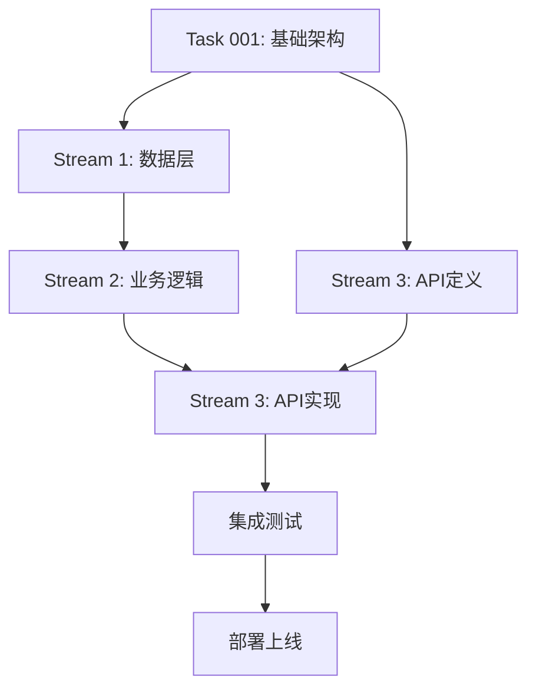

# Issue #57: 银联支付集成技术实现方案

## 文档信息
- **创建时间**: 2025-09-16
- **任务编号**: Issue #57 / Task 036
- **分析版本**: v1.0
- **依赖任务**: Task 001 (项目基础架构)

## 1. 技术分析

### 1.1 任务概述
集成银联支付功能，支持网关支付和快捷支付两种模式，包括支付创建、回调处理、SDK集成和安全处理。

### 1.2 现有架构对比分析

#### 支付系统现状
- **支付宝集成** (Task 55): 5工作日，支持官方SDK、异步回调、签名验证
- **微信支付集成** (Task 56): 5工作日，支持JSAPI/APP/H5、证书管理、统一下单
- **架构模式**: 统一的API端点结构 `/api/payments/{provider}/{action}`

#### 银联支付技术特点
- **支付模式**: 网关支付(跳转银行页面) + 快捷支付(绑卡支付)
- **安全要求**: 数字签名验证，传输加密
- **覆盖范围**: 传统银行卡，广泛兼容性
- **集成复杂度**: 中等，需要处理多种银行接口差异

### 1.3 技术架构兼容性
银联支付将完全遵循现有架构模式：
- **DDD领域驱动**: Payment Domain内的银联支付子域
- **Repository模式**: 数据访问层抽象
- **Service Layer**: 业务逻辑封装
- **依赖注入**: FastAPI内置DI系统

## 2. 架构设计

### 2.1 数据模型设计

#### 2.1.1 UnionPayOrder 模型
```python
class UnionPayOrder(BaseModel):
    """银联支付订单模型"""
    __tablename__ = "unionpay_orders"

    # 基础字段 (继承BaseModel的audit pattern)
    id = Column(Integer, primary_key=True)
    order_id = Column(String(64), unique=True, index=True)  # 内部订单号
    unionpay_order_id = Column(String(64), index=True)      # 银联订单号

    # 支付信息
    amount = Column(Decimal(10, 2), nullable=False)         # 支付金额
    currency = Column(String(3), default="CNY")             # 货币类型
    payment_type = Column(String(20), nullable=False)       # gateway/quick

    # 用户信息
    user_id = Column(Integer, ForeignKey("users.id"))
    user_ip = Column(String(45))                            # 用户IP

    # 银联特有字段
    gateway_type = Column(String(20))                       # 网关类型
    bank_code = Column(String(10))                          # 银行代码
    card_type = Column(String(10))                          # 卡类型(debit/credit)

    # 状态管理
    status = Column(String(20), default="pending")          # pending/paid/failed/cancelled
    unionpay_status = Column(String(20))                    # 银联原始状态

    # 回调信息
    notify_url = Column(String(512))                        # 异步通知URL
    return_url = Column(String(512))                        # 同步跳转URL

    # 软删除支持
    deleted_at = Column(DateTime, nullable=True)

    def soft_delete(self):
        self.deleted_at = datetime.utcnow()

    def can_be_paid(self) -> bool:
        return self.status == "pending" and self.deleted_at is None
```

#### 2.1.2 UnionPayCallback 模型
```python
class UnionPayCallback(BaseModel):
    """银联支付回调记录模型"""
    __tablename__ = "unionpay_callbacks"

    id = Column(Integer, primary_key=True)
    order_id = Column(String(64), ForeignKey("unionpay_orders.order_id"))

    # 回调数据
    callback_data = Column(JSON)                            # 完整回调数据
    signature = Column(Text)                                # 回调签名
    signature_verified = Column(Boolean, default=False)     # 签名验证结果

    # 处理状态
    processed = Column(Boolean, default=False)              # 是否已处理
    process_result = Column(String(20))                     # 处理结果
    error_message = Column(Text)                            # 错误信息

    # 幂等性处理
    callback_id = Column(String(64), unique=True)           # 回调唯一标识
    retry_count = Column(Integer, default=0)                # 重试次数

    # 审计字段
    created_at = Column(DateTime, default=datetime.utcnow)
    processed_at = Column(DateTime)
```

#### 2.1.3 UnionPayConfig 模型
```python
class UnionPayConfig(BaseModel):
    """银联支付配置模型"""
    __tablename__ = "unionpay_configs"

    id = Column(Integer, primary_key=True)
    environment = Column(String(20), nullable=False)        # sandbox/production

    # 商户信息 (加密存储)
    merchant_id = Column(String(128))                       # 商户号
    private_key = Column(Text)                              # 私钥
    public_key = Column(Text)                               # 银联公钥

    # 网关配置
    gateway_url = Column(String(512))                       # 网关地址
    query_url = Column(String(512))                         # 查询接口

    # 支付配置
    supported_banks = Column(JSON)                          # 支持的银行列表
    payment_timeout = Column(Integer, default=1800)        # 支付超时(秒)

    # 状态管理
    is_active = Column(Boolean, default=True)
    created_at = Column(DateTime, default=datetime.utcnow)
    updated_at = Column(DateTime, onupdate=datetime.utcnow)
```

### 2.2 API端点结构

遵循现有支付系统的统一接口规范：

#### 2.2.1 核心接口
```python
# 支付创建
POST /api/payments/unionpay/create
{
    "amount": "100.00",
    "payment_type": "gateway|quick",  # 支付方式
    "bank_code": "0102",              # 银行代码(可选)
    "return_url": "https://...",      # 跳转地址
    "notify_url": "https://...",      # 回调地址
    "product_info": {
        "name": "知识付费订阅",
        "description": "月度会员订阅"
    }
}

# 支付回调
POST /api/payments/unionpay/callback
# 接收银联异步通知，验证签名后更新订单状态

# 支付状态查询
GET /api/payments/unionpay/status/{order_id}
{
    "order_id": "UP202509161234567890",
    "status": "paid",
    "unionpay_status": "SUCCESS",
    "amount": "100.00",
    "paid_at": "2025-09-16T12:34:56Z"
}

# 支付验证
POST /api/payments/unionpay/verify
{
    "order_id": "UP202509161234567890",
    "signature": "...",
    "verify_result": true
}

# 支付配置
GET /api/payments/unionpay/config
{
    "supported_banks": [...],
    "payment_timeout": 1800,
    "gateway_url": "https://gateway.unionpay.com"
}
```

### 2.3 签名验证机制

#### 2.3.1 签名算法实现
```python
class UnionPaySigner:
    """银联签名验证器"""

    def __init__(self, private_key: str, public_key: str):
        self.private_key = private_key
        self.public_key = public_key

    def sign_request(self, params: Dict[str, Any]) -> str:
        """生成请求签名"""
        # 1. 过滤空值参数
        filtered_params = {k: v for k, v in params.items() if v}

        # 2. 按字典序排序
        sorted_params = sorted(filtered_params.items())

        # 3. 拼接签名字符串
        sign_str = "&".join([f"{k}={v}" for k, v in sorted_params])

        # 4. RSA签名
        return self._rsa_sign(sign_str)

    def verify_callback(self, params: Dict[str, Any], signature: str) -> bool:
        """验证回调签名"""
        # 移除签名字段
        sign_params = {k: v for k, v in params.items() if k != 'signature'}

        # 重构签名字符串
        sorted_params = sorted(sign_params.items())
        sign_str = "&".join([f"{k}={v}" for k, v in sorted_params])

        # 验证签名
        return self._rsa_verify(sign_str, signature)

    def _rsa_sign(self, data: str) -> str:
        """RSA私钥签名"""
        from cryptography.hazmat.primitives import hashes, serialization
        from cryptography.hazmat.primitives.asymmetric import rsa, padding

        private_key = serialization.load_pem_private_key(
            self.private_key.encode(), password=None
        )

        signature = private_key.sign(
            data.encode('utf-8'),
            padding.PKCS1v15(),
            hashes.SHA256()
        )

        return base64.b64encode(signature).decode()

    def _rsa_verify(self, data: str, signature: str) -> bool:
        """RSA公钥验签"""
        try:
            public_key = serialization.load_pem_public_key(
                self.public_key.encode()
            )

            public_key.verify(
                base64.b64decode(signature),
                data.encode('utf-8'),
                padding.PKCS1v15(),
                hashes.SHA256()
            )
            return True
        except Exception:
            return False
```

#### 2.3.2 安全传输协议
- **HTTPS强制**: 所有接口强制HTTPS传输
- **参数加密**: 敏感参数使用银联公钥加密
- **时间戳验证**: 防重放攻击，请求时间戳有效期5分钟
- **IP白名单**: 限制回调来源IP地址

### 2.4 错误处理策略

#### 2.4.1 异常分类和处理
```python
class UnionPayException(Exception):
    """银联支付异常基类"""
    pass

class SignatureVerificationError(UnionPayException):
    """签名验证失败"""
    pass

class PaymentTimeoutError(UnionPayException):
    """支付超时"""
    pass

class BankGatewayError(UnionPayException):
    """银行网关异常"""
    pass

# 异常处理中间件
@app.exception_handler(UnionPayException)
async def unionpay_exception_handler(request: Request, exc: UnionPayException):
    logger.error(f"UnionPay error: {exc}",
                 extra={"request_id": request.headers.get("X-Request-ID")})

    return JSONResponse(
        status_code=400,
        content={
            "error": "payment_error",
            "message": str(exc),
            "error_code": exc.__class__.__name__
        }
    )
```

#### 2.4.2 重试机制
- **网络超时**: 3次重试，指数退避(1s, 2s, 4s)
- **签名失败**: 不重试，直接拒绝
- **银行网关超时**: 5次重试，固定间隔30秒
- **回调处理失败**: 最多重试10次，间隔递增

## 3. 并行执行计划

### 3.1 Stream划分策略

基于任务依赖分析，可以划分为3个并行开发流：

#### Stream 1: 数据层开发 (1.5工作日)
- **负责人**: 后端开发工程师A
- **工作内容**:
  - 数据模型定义 (UnionPayOrder, UnionPayCallback, UnionPayConfig)
  - 数据库迁移脚本编写
  - Repository层实现 (UnionPayRepository)
  - 数据层单元测试 (覆盖率>95%)

#### Stream 2: 业务逻辑层开发 (2工作日)
- **负责人**: 后端开发工程师B
- **工作内容**:
  - UnionPayService业务逻辑实现
  - 签名验证算法开发 (UnionPaySigner)
  - 错误处理机制实现
  - 业务逻辑单元测试 (覆盖率>90%)

#### Stream 3: API控制器开发 (1.5工作日)
- **负责人**: 后端开发工程师C
- **工作内容**:
  - FastAPI路由控制器实现
  - Pydantic请求/响应模型定义
  - API文档生成和完善
  - API集成测试 (覆盖率>85%)

### 3.2 依赖关系管理



### 3.3 接口约定和协作

#### 3.3.1 数据层接口
```python
# Repository接口约定
class UnionPayRepositoryInterface:
    async def create_order(self, order_data: UnionPayOrderCreate) -> UnionPayOrder
    async def get_order_by_id(self, order_id: str) -> Optional[UnionPayOrder]
    async def update_order_status(self, order_id: str, status: str) -> bool
    async def create_callback_record(self, callback_data: UnionPayCallbackCreate) -> UnionPayCallback
```

#### 3.3.2 业务层接口
```python
# Service接口约定
class UnionPayServiceInterface:
    async def create_payment(self, payment_request: PaymentCreateRequest) -> PaymentCreateResponse
    async def handle_callback(self, callback_data: Dict) -> CallbackProcessResult
    async def query_payment_status(self, order_id: str) -> PaymentStatusResponse
    async def verify_payment(self, verify_request: PaymentVerifyRequest) -> PaymentVerifyResponse
```

### 3.4 时间优化分析

- **原始估时**: 4工作日 (串行开发)
- **并行优化**: 2.5工作日 (3个Stream并行)
- **时间节省**: 37.5% (1.5工作日)
- **风险缓冲**: 额外0.5工作日应对集成问题

## 4. 实现路径

### 4.1 分阶段实现策略

#### 第一阶段: 基础架构 (0.5工作日)
- [ ] 数据模型定义和迁移
- [ ] 基础配置和环境准备
- [ ] 核心接口约定
- [ ] 开发环境搭建

#### 第二阶段: 网关支付实现 (1工作日)
- [ ] 网关支付订单创建
- [ ] 银联网关跳转逻辑
- [ ] 同步回调处理
- [ ] 基础测试用例

#### 第三阶段: 快捷支付实现 (1工作日)
- [ ] 快捷支付订单创建
- [ ] 银行卡信息处理
- [ ] 支付确认流程
- [ ] 安全验证强化

#### 第四阶段: 回调和查询 (0.5工作日)
- [ ] 异步回调处理
- [ ] 支付状态查询
- [ ] 签名验证完善
- [ ] 幂等性保证

#### 第五阶段: 测试和优化 (0.5工作日)
- [ ] 完整测试覆盖
- [ ] 性能测试和优化
- [ ] 安全审计
- [ ] 文档完善

### 4.2 关键里程碑

1. **M1 - 基础架构完成**: 数据模型和基础服务就绪
2. **M2 - 网关支付可用**: 基本支付流程打通
3. **M3 - 快捷支付可用**: 完整支付功能实现
4. **M4 - 测试完成**: 质量验证通过
5. **M5 - 生产就绪**: 部署配置完成

### 4.3 质量保证

#### 4.3.1 测试覆盖率要求
- **单元测试**: >90% (符合任务要求)
- **集成测试**: >80%
- **E2E测试**: 核心流程100%覆盖

#### 4.3.2 代码质量标准
- **代码规范**: 遵循项目PEP 8标准
- **类型注解**: 100%类型提示覆盖
- **文档字符串**: 所有公共接口必须有文档
- **安全审计**: 通过静态安全分析

#### 4.3.3 性能要求
- **API响应时间**: <500ms (95分位)
- **数据库查询**: <100ms平均响应时间
- **并发支持**: 1000+ RPS处理能力
- **内存使用**: 单请求<50MB内存占用

## 5. 风险评估和缓解

### 5.1 技术风险

#### 5.1.1 银联SDK集成风险
- **风险描述**: 银联官方SDK版本兼容性问题
- **影响程度**: 中等
- **缓解措施**: 提前进行SDK版本调研，准备多版本兼容方案

#### 5.1.2 签名验证复杂性
- **风险描述**: 银联签名算法复杂，容易出错
- **影响程度**: 高
- **缓解措施**: 编写详细测试用例，与银联技术支持确认

#### 5.1.3 多银行网关差异
- **风险描述**: 不同银行网关可能有细微差异
- **影响程度**: 中等
- **缓解措施**: 重点测试主要银行，建立银行特殊处理机制

### 5.2 进度风险

#### 5.2.1 并行开发协调
- **风险描述**: 多个Stream并行可能产生集成问题
- **影响程度**: 中等
- **缓解措施**: 明确接口约定，每日站会同步进度

#### 5.2.2 测试环境限制
- **风险描述**: 银联测试环境可能不够稳定
- **影响程度**: 中等
- **缓解措施**: 准备Mock服务，不依赖外部测试环境

### 5.3 业务风险

#### 5.3.1 合规性要求
- **风险描述**: 银联支付可能有额外合规要求
- **影响程度**: 高
- **缓解措施**: 提前与银联商务和技术团队沟通

#### 5.3.2 用户体验差异
- **风险描述**: 银联支付流程可能与支付宝、微信不同
- **影响程度**: 中等
- **缓解措施**: 统一支付体验设计，保持一致性

## 6. 总结

### 6.1 技术方案优势
1. **架构一致性**: 完全兼容现有支付系统架构
2. **并行开发**: 通过Stream划分实现37.5%时间节省
3. **安全可靠**: 完善的签名验证和错误处理机制
4. **扩展性强**: 支持未来银联新功能快速集成

### 6.2 实施建议
1. **立即启动**: 数据层和API定义可以立即并行开始
2. **重点关注**: 签名验证和安全机制是核心难点
3. **测试先行**: 编写完整测试用例确保质量
4. **文档同步**: 开发过程中同步更新技术文档

### 6.3 后续规划
1. **性能优化**: 上线后根据实际使用情况优化性能
2. **功能扩展**: 支持更多银联支付产品(如无感支付)
3. **监控完善**: 建立完整的支付监控和告警体系
4. **用户体验**: 持续优化支付流程和用户体验

---

**文档状态**: ✅ 分析完成
**下一步行动**: 等待技术方案评审，准备启动并行开发