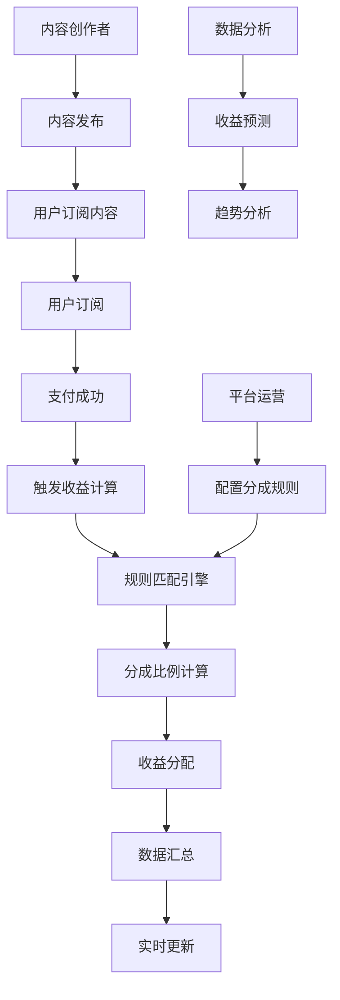

# Issue #60: 收益计算系统技术实现方案

## 文档信息
- **创建时间**: 2025-09-18
- **任务编号**: Issue #60 / Task 039
- **分析版本**: v1.0
- **依赖任务**: Task 050 (订阅套餐管理), Task 055 (支付宝集成)

## 1. 技术分析

### 1.1 任务概述
实现收益计算系统，包括收益计算、汇总、分成规则引擎和统计分析，支持实时收益计算、预测功能和对账机制。

### 1.2 现有系统架构分析

#### 已完成支付生态系统
基于执行状态分析，当前已完成完整的支付生态：

| 系统模块 | 完成状态 | 核心功能 | 技术特点 |
|----------|----------|----------|----------|
| 订阅套餐管理 | ✅ 完成 | 17个API端点、4种定价模式 | 完整订阅生命周期 |
| 支付宝集成 | ✅ 完成 | 7个支付API、3种支付方式 | RSA2签名安全 |
| 微信支付集成 | ✅ 完成 | 5个微信支付API、XML处理 | HMAC-SHA256签名 |
| 银联支付集成 | ✅ 完成 | 9个银联支付API、双支付模式 | RSA签名安全 |
| 支付状态管理 | ✅ 完成 | 统一支付状态管理、退款处理 | 跨平台状态管理 |

#### 收益计算系统的集成优势
1. **统一数据源**: 通过统一支付状态管理获取所有支付数据
2. **事件驱动**: 可监听支付成功事件触发收益计算
3. **完整链路**: 从订阅创建到支付完成的完整数据链路
4. **安全保障**: 继承现有系统的企业级安全防护

### 1.3 收益计算技术特点

#### 业务复杂性分析


#### 技术挑战
1. **实时性要求**: 支付成功后需要立即计算收益
2. **准确性要求**: 涉及资金分配，必须保证计算准确
3. **规则复杂性**: 支持多维度、多层级的分成规则
4. **数据一致性**: 确保收益计算与支付数据一致
5. **扩展性要求**: 支持新的分成模式和计算规则

## 2. 架构设计

### 2.1 总体架构

#### 2.1.1 分层架构设计
```
┌─────────────────────────────────────────────────────────┐
│                    API网关层                            │
│  ┌─────────────────┐ ┌─────────────────┐ ┌─────────────┐ │
│  │ 收益计算API     │ │ 收益查询API     │ │ 规则管理API │ │
│  └─────────────────┘ └─────────────────┘ └─────────────┘ │
└─────────────────────────────────────────────────────────┘
                           │
┌─────────────────────────────────────────────────────────┐
│                    业务服务层                           │
│  ┌─────────────────┐ ┌─────────────────┐ ┌─────────────┐ │
│  │ 收益计算服务    │ │ 规则引擎服务    │ │ 预测分析服务│ │
│  └─────────────────┘ └─────────────────┘ └─────────────┘ │
└─────────────────────────────────────────────────────────┘
                           │
┌─────────────────────────────────────────────────────────┐
│                    事件处理层                           │
│  ┌─────────────────┐ ┌─────────────────┐ ┌─────────────┐ │
│  │ 支付事件监听    │ │ 收益事件发布    │ │ 对账事件处理│ │
│  └─────────────────┘ └─────────────────┘ └─────────────┘ │
└─────────────────────────────────────────────────────────┘
                           │
┌─────────────────────────────────────────────────────────┐
│                    数据访问层                           │
│  ┌─────────────────┐ ┌─────────────────┐ ┌─────────────┐ │
│  │ 收益计算数据    │ │ 规则配置数据    │ │ 汇总统计数据│ │
│  └─────────────────┘ └─────────────────┘ └─────────────┘ │
└─────────────────────────────────────────────────────────┘
```

#### 2.1.2 技术架构模式
- **事件驱动架构**: 监听支付成功事件，异步处理收益计算
- **CQRS模式**: 读写分离，优化查询性能
- **规则引擎模式**: 灵活配置分成规则，支持复杂业务逻辑
- **事件溯源**: 保证数据可追溯和审计合规

### 2.2 数据模型设计

#### 2.2.1 EarningsCalculation 收益计算模型
```python
class EarningsCalculation(BaseModel):
    """收益计算记录模型"""
    __tablename__ = "earnings_calculations"

    # 主键和标识
    id = Column(Integer, primary_key=True)
    calculation_id = Column(String(64), unique=True, index=True, comment="计算唯一ID")

    # 关联数据
    payment_id = Column(String(64), nullable=False, index=True, comment="支付订单ID")
    user_id = Column(Integer, ForeignKey("users.id"), nullable=False, comment="支付用户ID")
    creator_id = Column(Integer, ForeignKey("users.id"), nullable=True, comment="内容创作者ID")
    subscription_plan_id = Column(Integer, ForeignKey("subscription_plans.id"), comment="订阅套餐ID")

    # 支付信息
    payment_platform = Column(String(20), nullable=False, comment="支付平台")
    original_amount = Column(Decimal(10, 2), nullable=False, comment="原始支付金额")
    currency = Column(String(3), default="CNY", comment="货币类型")

    # 分成计算
    rule_id = Column(String(64), nullable=False, comment="使用的分成规则ID")
    platform_fee_rate = Column(Decimal(5, 4), nullable=False, comment="平台费率")
    platform_fee_amount = Column(Decimal(10, 2), nullable=False, comment="平台费用")
    creator_share_rate = Column(Decimal(5, 4), nullable=True, comment="创作者分成比例")
    creator_earnings = Column(Decimal(10, 2), nullable=True, comment="创作者收益")
    platform_earnings = Column(Decimal(10, 2), nullable=False, comment="平台收益")

    # 计算状态
    calculation_status = Column(String(20), default="calculated", comment="计算状态")
    calculation_method = Column(String(50), nullable=False, comment="计算方法")

    # 验证和对账
    verified = Column(Boolean, default=False, comment="是否已验证")
    verified_at = Column(DateTime, nullable=True, comment="验证时间")
    reconciled = Column(Boolean, default=False, comment="是否已对账")
    reconciled_at = Column(DateTime, nullable=True, comment="对账时间")

    # 审计字段
    created_at = Column(DateTime, default=datetime.utcnow, comment="创建时间")
    updated_at = Column(DateTime, onupdate=datetime.utcnow, comment="更新时间")

    # 扩展信息
    metadata = Column(JSON, nullable=True, comment="扩展元数据")

    def calculate_earnings(self, rule: 'RevenueRule') -> None:
        """根据规则计算收益"""
        # 计算平台费用
        self.platform_fee_amount = self.original_amount * rule.platform_fee_rate

        # 计算剩余金额
        remaining_amount = self.original_amount - self.platform_fee_amount

        # 如果有创作者，计算创作者收益
        if self.creator_id and rule.creator_share_rate:
            self.creator_earnings = remaining_amount * rule.creator_share_rate
            self.platform_earnings = remaining_amount - self.creator_earnings
        else:
            self.creator_earnings = Decimal('0.00')
            self.platform_earnings = remaining_amount

        self.calculation_status = "calculated"

    def verify_calculation(self) -> bool:
        """验证计算正确性"""
        total_calculated = self.platform_fee_amount + self.creator_earnings + self.platform_earnings
        return abs(total_calculated - self.original_amount) < Decimal('0.01')
```

#### 2.2.2 RevenueRule 分成规则模型
```python
class RevenueRule(BaseModel):
    """分成规则模型"""
    __tablename__ = "revenue_rules"

    id = Column(Integer, primary_key=True)
    rule_id = Column(String(64), unique=True, index=True, comment="规则唯一ID")
    rule_name = Column(String(128), nullable=False, comment="规则名称")
    rule_description = Column(Text, nullable=True, comment="规则描述")

    # 规则类型和优先级
    rule_type = Column(String(50), nullable=False, comment="规则类型")
    priority = Column(Integer, default=100, comment="优先级(数字越小优先级越高)")

    # 匹配条件
    conditions = Column(JSON, nullable=False, comment="规则匹配条件")

    # 分成配置
    platform_fee_rate = Column(Decimal(5, 4), nullable=False, comment="平台费率")
    creator_share_rate = Column(Decimal(5, 4), nullable=True, comment="创作者分成比例")

    # 生效时间
    effective_from = Column(DateTime, nullable=False, comment="生效开始时间")
    effective_until = Column(DateTime, nullable=True, comment="生效结束时间")

    # 状态管理
    is_active = Column(Boolean, default=True, comment="是否激活")
    version = Column(Integer, default=1, comment="规则版本")

    # 审计字段
    created_by = Column(Integer, ForeignKey("users.id"), comment="创建者")
    created_at = Column(DateTime, default=datetime.utcnow, comment="创建时间")
    updated_at = Column(DateTime, onupdate=datetime.utcnow, comment="更新时间")

    def matches_payment(self, payment_data: Dict[str, Any]) -> bool:
        """检查规则是否匹配支付数据"""
        if not self.is_active:
            return False

        # 检查时间范围
        now = datetime.utcnow()
        if now < self.effective_from:
            return False
        if self.effective_until and now > self.effective_until:
            return False

        # 检查条件匹配
        return self._evaluate_conditions(payment_data)

    def _evaluate_conditions(self, payment_data: Dict[str, Any]) -> bool:
        """评估条件是否匹配"""
        conditions = self.conditions

        # 支持的条件类型：
        # - payment_platform: 支付平台匹配
        # - amount_range: 金额范围匹配
        # - subscription_plan: 订阅套餐匹配
        # - user_type: 用户类型匹配

        if 'payment_platform' in conditions:
            if payment_data.get('platform') not in conditions['payment_platform']:
                return False

        if 'amount_range' in conditions:
            amount = payment_data.get('amount', 0)
            range_config = conditions['amount_range']
            if amount < range_config.get('min', 0) or amount > range_config.get('max', float('inf')):
                return False

        if 'subscription_plan' in conditions:
            plan_id = payment_data.get('subscription_plan_id')
            if plan_id not in conditions['subscription_plan']:
                return False

        return True

# 规则配置示例
EXAMPLE_RULES = {
    "basic_platform_fee": {
        "rule_name": "基础平台费率",
        "rule_type": "default",
        "priority": 100,
        "conditions": {},  # 匹配所有支付
        "platform_fee_rate": "0.0300",  # 3%平台费
        "creator_share_rate": "0.7000"  # 创作者70%分成
    },
    "premium_creator_rule": {
        "rule_name": "优质创作者特殊分成",
        "rule_type": "creator_tier",
        "priority": 50,
        "conditions": {
            "user_type": ["premium_creator"],
            "amount_range": {"min": 100}
        },
        "platform_fee_rate": "0.0200",  # 2%平台费
        "creator_share_rate": "0.8000"  # 创作者80%分成
    },
    "large_payment_rule": {
        "rule_name": "大额支付优惠费率",
        "rule_type": "amount_based",
        "priority": 60,
        "conditions": {
            "amount_range": {"min": 1000}
        },
        "platform_fee_rate": "0.0250",  # 2.5%平台费
        "creator_share_rate": "0.7500"  # 创作者75%分成
    }
}
```

#### 2.2.3 EarningsSummary 收益汇总模型
```python
class EarningsSummary(BaseModel):
    """收益汇总模型"""
    __tablename__ = "earnings_summaries"

    id = Column(Integer, primary_key=True)
    summary_id = Column(String(64), unique=True, index=True, comment="汇总唯一ID")

    # 汇总维度
    summary_type = Column(String(50), nullable=False, comment="汇总类型") # daily/weekly/monthly
    summary_date = Column(Date, nullable=False, comment="汇总日期")
    user_id = Column(Integer, ForeignKey("users.id"), nullable=True, comment="用户ID(用户维度汇总)")
    creator_id = Column(Integer, ForeignKey("users.id"), nullable=True, comment="创作者ID(创作者维度汇总)")
    platform = Column(String(20), nullable=True, comment="平台(平台维度汇总)")

    # 汇总数据
    total_payments = Column(Integer, default=0, comment="总支付笔数")
    total_amount = Column(Decimal(12, 2), default=0, comment="总支付金额")
    total_platform_fees = Column(Decimal(12, 2), default=0, comment="总平台费用")
    total_creator_earnings = Column(Decimal(12, 2), default=0, comment="总创作者收益")
    total_platform_earnings = Column(Decimal(12, 2), default=0, comment="总平台收益")

    # 平均数据
    avg_payment_amount = Column(Decimal(10, 2), default=0, comment="平均支付金额")
    avg_creator_earnings = Column(Decimal(10, 2), default=0, comment="平均创作者收益")

    # 统计时间
    calculated_at = Column(DateTime, default=datetime.utcnow, comment="计算时间")

    # 复合索引
    __table_args__ = (
        Index('idx_summary_type_date', 'summary_type', 'summary_date'),
        Index('idx_user_summary', 'user_id', 'summary_type', 'summary_date'),
        Index('idx_creator_summary', 'creator_id', 'summary_type', 'summary_date'),
    )

    @classmethod
    async def calculate_daily_summary(cls, date: datetime.date, db: Session):
        """计算指定日期的日汇总"""
        # 全平台汇总
        await cls._calculate_platform_summary(date, db)

        # 按用户汇总
        await cls._calculate_user_summary(date, db)

        # 按创作者汇总
        await cls._calculate_creator_summary(date, db)

    @classmethod
    async def _calculate_platform_summary(cls, date: datetime.date, db: Session):
        """计算平台维度汇总"""
        query = text("""
            INSERT INTO earnings_summaries
            (summary_id, summary_type, summary_date, platform,
             total_payments, total_amount, total_platform_fees,
             total_creator_earnings, total_platform_earnings,
             avg_payment_amount, avg_creator_earnings)
            SELECT
                CONCAT('platform_', payment_platform, '_', DATE(:date)) as summary_id,
                'daily' as summary_type,
                :date as summary_date,
                payment_platform as platform,
                COUNT(*) as total_payments,
                SUM(original_amount) as total_amount,
                SUM(platform_fee_amount) as total_platform_fees,
                SUM(COALESCE(creator_earnings, 0)) as total_creator_earnings,
                SUM(platform_earnings) as total_platform_earnings,
                AVG(original_amount) as avg_payment_amount,
                AVG(COALESCE(creator_earnings, 0)) as avg_creator_earnings
            FROM earnings_calculations
            WHERE DATE(created_at) = :date
              AND calculation_status = 'calculated'
            GROUP BY payment_platform
            ON DUPLICATE KEY UPDATE
                total_payments = VALUES(total_payments),
                total_amount = VALUES(total_amount),
                total_platform_fees = VALUES(total_platform_fees),
                total_creator_earnings = VALUES(total_creator_earnings),
                total_platform_earnings = VALUES(total_platform_earnings),
                avg_payment_amount = VALUES(avg_payment_amount),
                avg_creator_earnings = VALUES(avg_creator_earnings),
                calculated_at = NOW()
        """)

        await db.execute(query, {"date": date})
        await db.commit()
```

### 2.3 规则引擎架构

#### 2.3.1 规则引擎核心组件
```python
class RuleEngine:
    """分成规则引擎"""

    def __init__(self, db: Session):
        self.db = db
        self.rule_cache = {}  # Redis缓存规则

    async def match_rules(self, payment_data: Dict[str, Any]) -> Optional[RevenueRule]:
        """匹配最适合的分成规则"""
        # 1. 获取所有激活规则
        active_rules = await self._get_active_rules()

        # 2. 过滤匹配的规则
        matching_rules = []
        for rule in active_rules:
            if rule.matches_payment(payment_data):
                matching_rules.append(rule)

        # 3. 按优先级排序，返回最高优先级规则
        if matching_rules:
            matching_rules.sort(key=lambda r: r.priority)
            return matching_rules[0]

        # 4. 如果没有匹配规则，使用默认规则
        return await self._get_default_rule()

    async def _get_active_rules(self) -> List[RevenueRule]:
        """获取所有激活规则"""
        cache_key = "active_revenue_rules"

        # 尝试从缓存获取
        cached_rules = await redis_client.get(cache_key)
        if cached_rules:
            return pickle.loads(cached_rules)

        # 从数据库查询
        query = select(RevenueRule).where(
            RevenueRule.is_active == True,
            RevenueRule.effective_from <= datetime.utcnow(),
            or_(
                RevenueRule.effective_until.is_(None),
                RevenueRule.effective_until > datetime.utcnow()
            )
        ).order_by(RevenueRule.priority)

        result = await self.db.execute(query)
        rules = result.scalars().all()

        # 缓存结果（30分钟）
        await redis_client.setex(
            cache_key, 1800, pickle.dumps(rules)
        )

        return rules

    async def _get_default_rule(self) -> RevenueRule:
        """获取默认规则"""
        query = select(RevenueRule).where(
            RevenueRule.rule_type == "default",
            RevenueRule.is_active == True
        )

        result = await self.db.execute(query)
        default_rule = result.scalar_one_or_none()

        if not default_rule:
            raise ValueError("No default revenue rule configured")

        return default_rule

class RuleConfigurationService:
    """规则配置服务"""

    def __init__(self, db: Session):
        self.db = db

    async def create_rule(self, rule_data: RevenueRuleCreate) -> RevenueRule:
        """创建分成规则"""
        # 验证规则配置
        self._validate_rule_config(rule_data)

        # 生成规则ID
        rule_id = f"rule_{int(time.time())}"

        # 创建规则
        rule = RevenueRule(
            rule_id=rule_id,
            **rule_data.dict()
        )

        self.db.add(rule)
        await self.db.commit()

        # 清除缓存
        await self._clear_rule_cache()

        return rule

    async def update_rule(self, rule_id: str, rule_data: RevenueRuleUpdate) -> RevenueRule:
        """更新分成规则"""
        rule = await self.get_rule_by_id(rule_id)

        # 创建新版本而不是直接更新
        new_version = rule.version + 1

        # 停用旧规则
        rule.is_active = False
        rule.effective_until = datetime.utcnow()

        # 创建新规则版本
        new_rule = RevenueRule(
            rule_id=f"{rule.rule_id}_v{new_version}",
            rule_name=rule_data.rule_name or rule.rule_name,
            rule_description=rule_data.rule_description or rule.rule_description,
            rule_type=rule.rule_type,
            priority=rule_data.priority or rule.priority,
            conditions=rule_data.conditions or rule.conditions,
            platform_fee_rate=rule_data.platform_fee_rate or rule.platform_fee_rate,
            creator_share_rate=rule_data.creator_share_rate or rule.creator_share_rate,
            effective_from=rule_data.effective_from or datetime.utcnow(),
            effective_until=rule_data.effective_until,
            version=new_version,
            created_by=rule_data.created_by
        )

        self.db.add(new_rule)
        await self.db.commit()

        # 清除缓存
        await self._clear_rule_cache()

        return new_rule

    def _validate_rule_config(self, rule_data: RevenueRuleCreate):
        """验证规则配置"""
        # 验证费率范围
        if not (0 <= rule_data.platform_fee_rate <= 1):
            raise ValueError("Platform fee rate must be between 0 and 1")

        if rule_data.creator_share_rate and not (0 <= rule_data.creator_share_rate <= 1):
            raise ValueError("Creator share rate must be between 0 and 1")

        # 验证总分成不超过100%
        total_rate = rule_data.platform_fee_rate
        if rule_data.creator_share_rate:
            # 创作者分成是从剩余金额中分成
            remaining_rate = 1 - rule_data.platform_fee_rate
            creator_actual_rate = remaining_rate * rule_data.creator_share_rate
            total_rate += creator_actual_rate

        if total_rate > 1:
            raise ValueError("Total distribution rate cannot exceed 100%")
```

### 2.4 实时计算框架

#### 2.4.1 事件驱动收益计算
```python
class EarningsCalculationService:
    """收益计算服务"""

    def __init__(self, db: Session, rule_engine: RuleEngine):
        self.db = db
        self.rule_engine = rule_engine

    async def handle_payment_success_event(self, payment_event: PaymentSuccessEvent):
        """处理支付成功事件"""
        try:
            # 检查是否已经计算过收益
            existing_calculation = await self._get_existing_calculation(payment_event.payment_id)
            if existing_calculation:
                logger.info(f"Earnings already calculated for payment {payment_event.payment_id}")
                return existing_calculation

            # 获取支付详情
            payment_details = await self._get_payment_details(payment_event.payment_id)

            # 匹配分成规则
            rule = await self.rule_engine.match_rules(payment_details)

            # 计算收益
            calculation = await self._calculate_earnings(payment_details, rule)

            # 验证计算结果
            if not calculation.verify_calculation():
                raise ValueError(f"Earnings calculation verification failed for payment {payment_event.payment_id}")

            # 保存计算结果
            self.db.add(calculation)
            await self.db.commit()

            # 发布收益计算完成事件
            await self._publish_earnings_calculated_event(calculation)

            # 异步更新汇总数据
            await self._schedule_summary_update(calculation)

            return calculation

        except Exception as e:
            logger.error(f"Failed to calculate earnings for payment {payment_event.payment_id}: {e}")
            # 发布计算失败事件
            await self._publish_earnings_calculation_failed_event(payment_event.payment_id, str(e))
            raise

    async def _calculate_earnings(self, payment_details: Dict, rule: RevenueRule) -> EarningsCalculation:
        """执行收益计算"""
        calculation = EarningsCalculation(
            calculation_id=f"calc_{int(time.time())}_{payment_details['payment_id'][-8:]}",
            payment_id=payment_details['payment_id'],
            user_id=payment_details['user_id'],
            creator_id=payment_details.get('creator_id'),
            subscription_plan_id=payment_details.get('subscription_plan_id'),
            payment_platform=payment_details['platform'],
            original_amount=Decimal(str(payment_details['amount'])),
            currency=payment_details.get('currency', 'CNY'),
            rule_id=rule.rule_id,
            platform_fee_rate=rule.platform_fee_rate,
            creator_share_rate=rule.creator_share_rate,
            calculation_method=f"rule_engine_v1_{rule.rule_type}"
        )

        # 执行计算
        calculation.calculate_earnings(rule)

        return calculation

    async def batch_calculate_earnings(self, payment_ids: List[str]) -> List[EarningsCalculation]:
        """批量计算收益"""
        results = []

        # 并发处理，但控制并发数避免压垮数据库
        semaphore = asyncio.Semaphore(10)

        async def calculate_single(payment_id: str):
            async with semaphore:
                try:
                    event = PaymentSuccessEvent(payment_id=payment_id)
                    return await self.handle_payment_success_event(event)
                except Exception as e:
                    logger.error(f"Failed to calculate earnings for payment {payment_id}: {e}")
                    return None

        tasks = [calculate_single(pid) for pid in payment_ids]
        results = await asyncio.gather(*tasks, return_exceptions=True)

        # 过滤成功的结果
        successful_results = [r for r in results if isinstance(r, EarningsCalculation)]

        return successful_results

# Celery任务定义
@celery_app.task(bind=True, max_retries=3)
def calculate_earnings_task(self, payment_id: str):
    """异步收益计算任务"""
    try:
        with SessionLocal() as db:
            rule_engine = RuleEngine(db)
            earnings_service = EarningsCalculationService(db, rule_engine)

            event = PaymentSuccessEvent(payment_id=payment_id)
            result = asyncio.run(earnings_service.handle_payment_success_event(event))

            return {
                "success": True,
                "calculation_id": result.calculation_id,
                "earnings_amount": float(result.creator_earnings or 0)
            }

    except Exception as e:
        logger.error(f"Earnings calculation task failed: {e}")

        # 重试机制
        if self.request.retries < self.max_retries:
            # 指数退避重试
            retry_delay = 2 ** self.request.retries
            raise self.retry(countdown=retry_delay, exc=e)
        else:
            # 最终失败，记录到失败队列
            return {
                "success": False,
                "error": str(e),
                "payment_id": payment_id
            }
```

#### 2.4.2 实时汇总更新
```python
class RealTimeSummaryService:
    """实时汇总服务"""

    def __init__(self, db: Session):
        self.db = db

    async def update_summary_on_earnings_calculated(self, calculation: EarningsCalculation):
        """收益计算完成后更新实时汇总"""
        try:
            # 更新用户汇总
            await self._update_user_summary(calculation)

            # 更新创作者汇总
            if calculation.creator_id:
                await self._update_creator_summary(calculation)

            # 更新平台汇总
            await self._update_platform_summary(calculation)

            # 更新Redis实时数据
            await self._update_realtime_cache(calculation)

        except Exception as e:
            logger.error(f"Failed to update summary for calculation {calculation.calculation_id}: {e}")

    async def _update_user_summary(self, calculation: EarningsCalculation):
        """更新用户维度汇总"""
        today = calculation.created_at.date()
        summary_id = f"user_{calculation.user_id}_daily_{today}"

        # 使用UPSERT语句更新汇总
        query = text("""
            INSERT INTO earnings_summaries
            (summary_id, summary_type, summary_date, user_id,
             total_payments, total_amount, total_platform_fees,
             total_creator_earnings, total_platform_earnings)
            VALUES (:summary_id, 'daily', :date, :user_id, 1, :amount, :platform_fee, :creator_earnings, :platform_earnings)
            ON DUPLICATE KEY UPDATE
                total_payments = total_payments + 1,
                total_amount = total_amount + :amount,
                total_platform_fees = total_platform_fees + :platform_fee,
                total_creator_earnings = total_creator_earnings + :creator_earnings,
                total_platform_earnings = total_platform_earnings + :platform_earnings,
                avg_payment_amount = total_amount / total_payments,
                calculated_at = NOW()
        """)

        await self.db.execute(query, {
            "summary_id": summary_id,
            "date": today,
            "user_id": calculation.user_id,
            "amount": calculation.original_amount,
            "platform_fee": calculation.platform_fee_amount,
            "creator_earnings": calculation.creator_earnings or 0,
            "platform_earnings": calculation.platform_earnings
        })

    async def _update_realtime_cache(self, calculation: EarningsCalculation):
        """更新Redis实时缓存"""
        # 更新今日实时统计
        today_key = f"earnings:realtime:{datetime.now().strftime('%Y-%m-%d')}"

        pipe = redis_client.pipeline()

        # 增加支付笔数
        pipe.hincrby(today_key, "total_payments", 1)

        # 增加金额
        pipe.hincrbyfloat(today_key, "total_amount", float(calculation.original_amount))
        pipe.hincrbyfloat(today_key, "total_platform_fees", float(calculation.platform_fee_amount))
        pipe.hincrbyfloat(today_key, "total_creator_earnings", float(calculation.creator_earnings or 0))
        pipe.hincrbyfloat(today_key, "total_platform_earnings", float(calculation.platform_earnings))

        # 设置过期时间（7天）
        pipe.expire(today_key, 604800)

        await pipe.execute()

        # 更新用户实时数据
        if calculation.creator_id:
            creator_key = f"earnings:creator:{calculation.creator_id}:today"

            pipe = redis_client.pipeline()
            pipe.hincrbyfloat(creator_key, "earnings", float(calculation.creator_earnings))
            pipe.hincrby(creator_key, "payments", 1)
            pipe.expire(creator_key, 86400)  # 24小时过期

            await pipe.execute()
```

### 2.5 预测算法设计

#### 2.5.1 时间序列预测服务
```python
class EarningsForecastService:
    """收益预测服务"""

    def __init__(self, db: Session):
        self.db = db

    async def forecast_user_earnings(
        self,
        user_id: int,
        forecast_days: int = 30
    ) -> Dict[str, Any]:
        """预测用户收益"""
        # 获取历史数据
        historical_data = await self._get_user_historical_earnings(user_id, days=90)

        if len(historical_data) < 7:
            return {
                "forecast_type": "insufficient_data",
                "message": "历史数据不足，无法进行预测",
                "min_required_days": 7
            }

        # 选择预测算法
        if len(historical_data) >= 30:
            # 使用更复杂的模型
            forecast = await self._arima_forecast(historical_data, forecast_days)
        else:
            # 使用简单移动平均
            forecast = await self._moving_average_forecast(historical_data, forecast_days)

        return {
            "forecast_type": forecast["model_type"],
            "user_id": user_id,
            "forecast_period_days": forecast_days,
            "predicted_total_earnings": forecast["total_earnings"],
            "daily_predictions": forecast["daily_values"],
            "confidence_level": forecast["confidence"],
            "historical_average": forecast["historical_avg"],
            "trend": forecast["trend"],
            "generated_at": datetime.utcnow().isoformat()
        }

    async def _moving_average_forecast(
        self,
        historical_data: List[Dict],
        forecast_days: int
    ) -> Dict[str, Any]:
        """移动平均预测"""
        import numpy as np

        # 提取收益数据
        earnings = [float(d['daily_earnings']) for d in historical_data]

        # 计算移动平均
        window_size = min(7, len(earnings))  # 7天移动平均
        if len(earnings) >= window_size:
            moving_avg = np.mean(earnings[-window_size:])
        else:
            moving_avg = np.mean(earnings)

        # 计算趋势
        if len(earnings) >= 14:
            recent_avg = np.mean(earnings[-7:])
            earlier_avg = np.mean(earnings[-14:-7])
            trend = (recent_avg - earlier_avg) / earlier_avg if earlier_avg > 0 else 0
        else:
            trend = 0

        # 应用趋势调整
        daily_predictions = []
        for day in range(forecast_days):
            # 趋势调整因子
            trend_factor = 1 + (trend * day / 30)  # 线性趋势应用
            predicted_value = moving_avg * trend_factor
            daily_predictions.append(max(0, predicted_value))  # 确保非负

        return {
            "model_type": "moving_average",
            "total_earnings": sum(daily_predictions),
            "daily_values": daily_predictions,
            "confidence": 0.6,  # 移动平均的置信度相对较低
            "historical_avg": moving_avg,
            "trend": trend
        }

    async def _arima_forecast(
        self,
        historical_data: List[Dict],
        forecast_days: int
    ) -> Dict[str, Any]:
        """ARIMA时间序列预测"""
        try:
            import pandas as pd
            from statsmodels.tsa.arima.model import ARIMA
            import numpy as np

            # 准备数据
            df = pd.DataFrame(historical_data)
            df['date'] = pd.to_datetime(df['date'])
            df = df.set_index('date')
            df['daily_earnings'] = df['daily_earnings'].astype(float)

            # 处理缺失值
            df['daily_earnings'] = df['daily_earnings'].fillna(df['daily_earnings'].mean())

            # 拟合ARIMA模型
            model = ARIMA(df['daily_earnings'], order=(1, 1, 1))  # 简单的ARIMA(1,1,1)
            fitted_model = model.fit()

            # 进行预测
            forecast_result = fitted_model.forecast(steps=forecast_days)
            forecast_values = [max(0, float(v)) for v in forecast_result]

            # 计算置信区间
            forecast_ci = fitted_model.get_forecast(steps=forecast_days).conf_int()

            # 计算历史平均和趋势
            historical_avg = float(df['daily_earnings'].mean())
            recent_values = df['daily_earnings'].tail(7).values
            if len(recent_values) >= 2:
                trend = float(np.polyfit(range(len(recent_values)), recent_values, 1)[0])
            else:
                trend = 0

            return {
                "model_type": "arima",
                "total_earnings": sum(forecast_values),
                "daily_values": forecast_values,
                "confidence": 0.8,  # ARIMA模型置信度较高
                "historical_avg": historical_avg,
                "trend": trend,
                "confidence_intervals": forecast_ci.values.tolist()
            }

        except Exception as e:
            logger.warning(f"ARIMA forecast failed, falling back to moving average: {e}")
            # 降级到移动平均
            return await self._moving_average_forecast(historical_data, forecast_days)

    async def forecast_platform_earnings(self, forecast_days: int = 30) -> Dict[str, Any]:
        """预测平台整体收益"""
        # 获取平台历史数据
        historical_data = await self._get_platform_historical_earnings(days=90)

        # 按支付平台分别预测
        platform_forecasts = {}

        for platform in ['alipay', 'wechat', 'unionpay']:
            platform_data = [d for d in historical_data if d['platform'] == platform]

            if len(platform_data) >= 7:
                forecast = await self._arima_forecast(platform_data, forecast_days)
                platform_forecasts[platform] = forecast

        # 汇总预测结果
        total_forecast = sum(f['total_earnings'] for f in platform_forecasts.values())

        return {
            "forecast_type": "platform_comprehensive",
            "forecast_period_days": forecast_days,
            "total_predicted_earnings": total_forecast,
            "platform_breakdown": platform_forecasts,
            "generated_at": datetime.utcnow().isoformat()
        }

    async def _get_user_historical_earnings(self, user_id: int, days: int = 90) -> List[Dict]:
        """获取用户历史收益数据"""
        query = text("""
            SELECT
                DATE(created_at) as date,
                SUM(COALESCE(creator_earnings, 0)) as daily_earnings,
                COUNT(*) as payment_count
            FROM earnings_calculations
            WHERE creator_id = :user_id
              AND created_at >= DATE_SUB(NOW(), INTERVAL :days DAY)
              AND calculation_status = 'calculated'
            GROUP BY DATE(created_at)
            ORDER BY date ASC
        """)

        result = await self.db.execute(query, {"user_id": user_id, "days": days})

        return [
            {
                "date": row.date.isoformat(),
                "daily_earnings": float(row.daily_earnings),
                "payment_count": row.payment_count
            }
            for row in result
        ]
```

### 2.6 对账验证机制

#### 2.6.1 自动对账服务
```python
class EarningsReconciliationService:
    """收益对账服务"""

    def __init__(self, db: Session):
        self.db = db

    async def daily_reconciliation(self, date: datetime.date) -> ReconciliationReport:
        """日对账"""
        report = ReconciliationReport(
            reconciliation_type="daily",
            reconciliation_date=date,
            started_at=datetime.utcnow()
        )

        try:
            # 1. 检查支付订单与收益计算的一致性
            payment_check = await self._check_payment_earnings_consistency(date)
            report.add_check_result("payment_consistency", payment_check)

            # 2. 检查金额计算准确性
            amount_check = await self._check_amount_calculation_accuracy(date)
            report.add_check_result("amount_accuracy", amount_check)

            # 3. 检查汇总数据准确性
            summary_check = await self._check_summary_accuracy(date)
            report.add_check_result("summary_accuracy", summary_check)

            # 4. 检查规则应用正确性
            rule_check = await self._check_rule_application_correctness(date)
            report.add_check_result("rule_correctness", rule_check)

            # 5. 生成对账报告
            report.completed_at = datetime.utcnow()
            report.overall_status = "passed" if report.all_checks_passed() else "failed"

            # 6. 保存对账报告
            await self._save_reconciliation_report(report)

            # 7. 如果有差异，发送告警
            if not report.all_checks_passed():
                await self._send_reconciliation_alert(report)

            return report

        except Exception as e:
            report.error_message = str(e)
            report.overall_status = "error"
            logger.error(f"Daily reconciliation failed for {date}: {e}")
            raise

    async def _check_payment_earnings_consistency(self, date: datetime.date) -> CheckResult:
        """检查支付订单与收益计算的一致性"""
        # 查找有支付记录但没有收益计算的订单
        missing_earnings_query = text("""
            SELECT up.payment_id, up.amount, up.platform
            FROM unified_payments up
            LEFT JOIN earnings_calculations ec ON up.payment_id = ec.payment_id
            WHERE DATE(up.paid_at) = :date
              AND up.unified_status = 'success'
              AND ec.id IS NULL
        """)

        missing_result = await self.db.execute(missing_earnings_query, {"date": date})
        missing_earnings = missing_result.fetchall()

        # 查找有收益计算但没有对应支付记录的计算
        orphaned_earnings_query = text("""
            SELECT ec.calculation_id, ec.payment_id, ec.original_amount
            FROM earnings_calculations ec
            LEFT JOIN unified_payments up ON ec.payment_id = up.payment_id
            WHERE DATE(ec.created_at) = :date
              AND up.id IS NULL
        """)

        orphaned_result = await self.db.execute(orphaned_earnings_query, {"date": date})
        orphaned_earnings = orphaned_result.fetchall()

        issues = []

        # 记录缺失的收益计算
        for payment in missing_earnings:
            issues.append({
                "type": "missing_earnings_calculation",
                "payment_id": payment.payment_id,
                "amount": float(payment.amount),
                "platform": payment.platform
            })

        # 记录孤立的收益计算
        for earnings in orphaned_earnings:
            issues.append({
                "type": "orphaned_earnings_calculation",
                "calculation_id": earnings.calculation_id,
                "payment_id": earnings.payment_id,
                "amount": float(earnings.original_amount)
            })

        return CheckResult(
            check_name="payment_consistency",
            passed=len(issues) == 0,
            issues_count=len(issues),
            issues=issues
        )

    async def _check_amount_calculation_accuracy(self, date: datetime.date) -> CheckResult:
        """检查金额计算准确性"""
        query = text("""
            SELECT
                calculation_id,
                original_amount,
                platform_fee_amount,
                creator_earnings,
                platform_earnings,
                platform_fee_rate,
                creator_share_rate
            FROM earnings_calculations
            WHERE DATE(created_at) = :date
              AND calculation_status = 'calculated'
        """)

        result = await self.db.execute(query, {"date": date})
        calculations = result.fetchall()

        issues = []

        for calc in calculations:
            # 重新计算验证
            expected_platform_fee = calc.original_amount * calc.platform_fee_rate
            remaining_amount = calc.original_amount - expected_platform_fee

            if calc.creator_share_rate:
                expected_creator_earnings = remaining_amount * calc.creator_share_rate
                expected_platform_earnings = remaining_amount - expected_creator_earnings
            else:
                expected_creator_earnings = Decimal('0.00')
                expected_platform_earnings = remaining_amount

            # 检查计算精度（允许0.01的误差）
            platform_fee_diff = abs(calc.platform_fee_amount - expected_platform_fee)
            creator_earnings_diff = abs((calc.creator_earnings or 0) - expected_creator_earnings)
            platform_earnings_diff = abs(calc.platform_earnings - expected_platform_earnings)

            if platform_fee_diff > Decimal('0.01'):
                issues.append({
                    "type": "platform_fee_calculation_error",
                    "calculation_id": calc.calculation_id,
                    "expected": float(expected_platform_fee),
                    "actual": float(calc.platform_fee_amount),
                    "difference": float(platform_fee_diff)
                })

            if creator_earnings_diff > Decimal('0.01'):
                issues.append({
                    "type": "creator_earnings_calculation_error",
                    "calculation_id": calc.calculation_id,
                    "expected": float(expected_creator_earnings),
                    "actual": float(calc.creator_earnings or 0),
                    "difference": float(creator_earnings_diff)
                })

            if platform_earnings_diff > Decimal('0.01'):
                issues.append({
                    "type": "platform_earnings_calculation_error",
                    "calculation_id": calc.calculation_id,
                    "expected": float(expected_platform_earnings),
                    "actual": float(calc.platform_earnings),
                    "difference": float(platform_earnings_diff)
                })

        return CheckResult(
            check_name="amount_accuracy",
            passed=len(issues) == 0,
            issues_count=len(issues),
            issues=issues
        )

    async def _check_summary_accuracy(self, date: datetime.date) -> CheckResult:
        """检查汇总数据准确性"""
        # 从明细重新计算汇总
        detail_query = text("""
            SELECT
                payment_platform,
                COUNT(*) as payment_count,
                SUM(original_amount) as total_amount,
                SUM(platform_fee_amount) as total_platform_fees,
                SUM(COALESCE(creator_earnings, 0)) as total_creator_earnings,
                SUM(platform_earnings) as total_platform_earnings
            FROM earnings_calculations
            WHERE DATE(created_at) = :date
              AND calculation_status = 'calculated'
            GROUP BY payment_platform
        """)

        detail_result = await self.db.execute(detail_query, {"date": date})
        detail_summaries = {row.payment_platform: row for row in detail_result}

        # 获取已存储的汇总数据
        summary_query = text("""
            SELECT
                platform,
                total_payments,
                total_amount,
                total_platform_fees,
                total_creator_earnings,
                total_platform_earnings
            FROM earnings_summaries
            WHERE summary_date = :date
              AND summary_type = 'daily'
              AND platform IS NOT NULL
        """)

        summary_result = await self.db.execute(summary_query, {"date": date})
        stored_summaries = {row.platform: row for row in summary_result}

        issues = []

        # 比较每个平台的汇总数据
        for platform, detail in detail_summaries.items():
            stored = stored_summaries.get(platform)

            if not stored:
                issues.append({
                    "type": "missing_summary",
                    "platform": platform,
                    "detail_payments": detail.payment_count,
                    "detail_amount": float(detail.total_amount)
                })
                continue

            # 检查各项金额
            checks = [
                ("payment_count", detail.payment_count, stored.total_payments),
                ("total_amount", float(detail.total_amount), float(stored.total_amount)),
                ("platform_fees", float(detail.total_platform_fees), float(stored.total_platform_fees)),
                ("creator_earnings", float(detail.total_creator_earnings), float(stored.total_creator_earnings)),
                ("platform_earnings", float(detail.total_platform_earnings), float(stored.total_platform_earnings))
            ]

            for check_name, expected, actual in checks:
                if isinstance(expected, (int, float)) and isinstance(actual, (int, float)):
                    diff = abs(expected - actual)
                    if diff > 0.01:  # 允许0.01的误差
                        issues.append({
                            "type": "summary_mismatch",
                            "platform": platform,
                            "field": check_name,
                            "expected": expected,
                            "actual": actual,
                            "difference": diff
                        })

        return CheckResult(
            check_name="summary_accuracy",
            passed=len(issues) == 0,
            issues_count=len(issues),
            issues=issues
        )

class ReconciliationReport:
    """对账报告"""

    def __init__(self, reconciliation_type: str, reconciliation_date: datetime.date):
        self.reconciliation_type = reconciliation_type
        self.reconciliation_date = reconciliation_date
        self.started_at = None
        self.completed_at = None
        self.overall_status = "running"
        self.check_results = {}
        self.error_message = None

    def add_check_result(self, check_name: str, result: CheckResult):
        """添加检查结果"""
        self.check_results[check_name] = result

    def all_checks_passed(self) -> bool:
        """所有检查是否都通过"""
        return all(result.passed for result in self.check_results.values())

    def get_total_issues(self) -> int:
        """获取总问题数"""
        return sum(result.issues_count for result in self.check_results.values())

    def to_dict(self) -> Dict[str, Any]:
        """转换为字典格式"""
        return {
            "reconciliation_type": self.reconciliation_type,
            "reconciliation_date": self.reconciliation_date.isoformat(),
            "started_at": self.started_at.isoformat() if self.started_at else None,
            "completed_at": self.completed_at.isoformat() if self.completed_at else None,
            "overall_status": self.overall_status,
            "total_issues": self.get_total_issues(),
            "check_results": {
                name: {
                    "passed": result.passed,
                    "issues_count": result.issues_count,
                    "issues": result.issues
                }
                for name, result in self.check_results.items()
            },
            "error_message": self.error_message
        }

class CheckResult:
    """检查结果"""

    def __init__(self, check_name: str, passed: bool, issues_count: int, issues: List[Dict]):
        self.check_name = check_name
        self.passed = passed
        self.issues_count = issues_count
        self.issues = issues

# 定时对账任务
@celery_app.task
def daily_reconciliation_task():
    """每日对账任务"""
    yesterday = (datetime.now() - timedelta(days=1)).date()

    with SessionLocal() as db:
        reconciliation_service = EarningsReconciliationService(db)

        try:
            report = asyncio.run(reconciliation_service.daily_reconciliation(yesterday))

            logger.info(f"Daily reconciliation completed for {yesterday}")
            logger.info(f"Status: {report.overall_status}, Issues: {report.get_total_issues()}")

            return report.to_dict()

        except Exception as e:
            logger.error(f"Daily reconciliation failed for {yesterday}: {e}")
            raise

# Celery Beat调度配置
celery_app.conf.beat_schedule.update({
    'daily-earnings-reconciliation': {
        'task': 'daily_reconciliation_task',
        'schedule': crontab(hour=2, minute=0),  # 每天凌晨2点执行
    }
})
```

## 3. 系统集成设计

### 3.1 与现有支付系统集成

#### 3.1.1 事件监听集成
```python
class PaymentEventListener:
    """支付事件监听器"""

    def __init__(self, earnings_service: EarningsCalculationService):
        self.earnings_service = earnings_service

    async def handle_payment_success(self, event_data: Dict[str, Any]):
        """处理支付成功事件"""
        try:
            # 从事件数据中提取支付信息
            payment_id = event_data.get('payment_id')
            if not payment_id:
                logger.warning("Payment success event missing payment_id")
                return

            # 异步计算收益，避免阻塞支付流程
            calculate_earnings_task.delay(payment_id)

            logger.info(f"Scheduled earnings calculation for payment {payment_id}")

        except Exception as e:
            logger.error(f"Failed to handle payment success event: {e}")

    async def handle_payment_refund(self, event_data: Dict[str, Any]):
        """处理支付退款事件"""
        try:
            payment_id = event_data.get('payment_id')
            refund_amount = event_data.get('refund_amount')

            # 处理收益调整
            await self._handle_earnings_adjustment(payment_id, refund_amount)

        except Exception as e:
            logger.error(f"Failed to handle payment refund event: {e}")

    async def _handle_earnings_adjustment(self, payment_id: str, refund_amount: Decimal):
        """处理收益调整"""
        # 查找原始收益计算
        original_calculation = await self._get_calculation_by_payment_id(payment_id)

        if not original_calculation:
            logger.warning(f"No earnings calculation found for payment {payment_id}")
            return

        # 计算需要调整的收益
        refund_ratio = refund_amount / original_calculation.original_amount

        # 创建调整记录
        adjustment = EarningsAdjustment(
            adjustment_id=f"adj_{int(time.time())}_{payment_id[-8:]}",
            original_calculation_id=original_calculation.calculation_id,
            adjustment_type="refund",
            adjustment_amount=-refund_amount,
            adjustment_reason=f"Refund adjustment for payment {payment_id}",
            platform_fee_adjustment=-original_calculation.platform_fee_amount * refund_ratio,
            creator_earnings_adjustment=-(original_calculation.creator_earnings or 0) * refund_ratio,
            platform_earnings_adjustment=-original_calculation.platform_earnings * refund_ratio
        )

        # 保存调整记录
        await self._save_earnings_adjustment(adjustment)

# 在支付状态管理系统中注册事件监听器
def register_earnings_event_listeners():
    """注册收益计算事件监听器"""
    from app.services.payment_status_service import PaymentEventService

    payment_event_service = PaymentEventService()
    earnings_service = EarningsCalculationService(SessionLocal(), RuleEngine(SessionLocal()))
    listener = PaymentEventListener(earnings_service)

    # 注册支付成功事件监听
    payment_event_service.subscribe("payment_success", listener.handle_payment_success)

    # 注册退款事件监听
    payment_event_service.subscribe("payment_refund", listener.handle_payment_refund)
```

#### 3.1.2 数据同步机制
```python
class PaymentDataSyncService:
    """支付数据同步服务"""

    def __init__(self, db: Session):
        self.db = db

    async def sync_historical_payments(self, start_date: datetime.date, end_date: datetime.date):
        """同步历史支付数据"""
        logger.info(f"Starting historical payment sync from {start_date} to {end_date}")

        # 获取指定时间范围内的成功支付
        query = text("""
            SELECT
                payment_id,
                platform,
                amount,
                currency,
                user_id,
                paid_at,
                metadata
            FROM unified_payments
            WHERE unified_status = 'success'
              AND DATE(paid_at) BETWEEN :start_date AND :end_date
              AND payment_id NOT IN (
                  SELECT DISTINCT payment_id
                  FROM earnings_calculations
                  WHERE DATE(created_at) BETWEEN :start_date AND :end_date
              )
            ORDER BY paid_at ASC
        """)

        result = await self.db.execute(query, {
            "start_date": start_date,
            "end_date": end_date
        })

        payments = result.fetchall()

        logger.info(f"Found {len(payments)} payments to sync")

        # 批量处理支付数据
        batch_size = 100
        for i in range(0, len(payments), batch_size):
            batch = payments[i:i + batch_size]
            await self._process_payment_batch(batch)

        logger.info(f"Historical payment sync completed")

    async def _process_payment_batch(self, payments: List):
        """处理支付批次"""
        tasks = []

        for payment in payments:
            # 创建支付成功事件
            task = calculate_earnings_task.delay(payment.payment_id)
            tasks.append(task)

        # 等待所有任务完成
        for task in tasks:
            try:
                result = task.get(timeout=30)
                if not result.get('success'):
                    logger.error(f"Failed to calculate earnings for payment: {result}")
            except Exception as e:
                logger.error(f"Task execution failed: {e}")
```

### 3.2 API端点设计

#### 3.2.1 收益计算API
```python
from fastapi import APIRouter, Depends, HTTPException, Query
from typing import List, Optional
from decimal import Decimal

router = APIRouter(prefix="/api/earnings", tags=["earnings"])

@router.post("/calculate")
async def calculate_earnings(
    request: EarningsCalculateRequest,
    current_user: User = Depends(get_current_user),
    db: Session = Depends(get_db)
) -> EarningsCalculateResponse:
    """手动触发收益计算"""

    if not current_user.has_permission("earnings.calculate"):
        raise HTTPException(status_code=403, detail="Insufficient permissions")

    try:
        rule_engine = RuleEngine(db)
        earnings_service = EarningsCalculationService(db, rule_engine)

        # 获取支付详情
        payment = await get_payment_by_id(request.payment_id, db)
        if not payment:
            raise HTTPException(status_code=404, detail="Payment not found")

        if payment.unified_status != "success":
            raise HTTPException(status_code=400, detail="Payment not successful")

        # 检查是否已经计算过
        existing = await get_earnings_calculation_by_payment_id(request.payment_id, db)
        if existing:
            return EarningsCalculateResponse(
                calculation_id=existing.calculation_id,
                payment_id=request.payment_id,
                status="already_calculated",
                message="Earnings already calculated for this payment"
            )

        # 执行计算
        calculation = await earnings_service.handle_payment_success_event(
            PaymentSuccessEvent(payment_id=request.payment_id)
        )

        return EarningsCalculateResponse(
            calculation_id=calculation.calculation_id,
            payment_id=request.payment_id,
            original_amount=calculation.original_amount,
            platform_fee_amount=calculation.platform_fee_amount,
            creator_earnings=calculation.creator_earnings,
            platform_earnings=calculation.platform_earnings,
            rule_id=calculation.rule_id,
            status="calculated"
        )

    except Exception as e:
        logger.error(f"Failed to calculate earnings for payment {request.payment_id}: {e}")
        raise HTTPException(status_code=500, detail=str(e))

@router.get("/summary")
async def get_earnings_summary(
    user_id: Optional[int] = Query(None, description="用户ID(不指定则查询当前用户)"),
    creator_id: Optional[int] = Query(None, description="创作者ID"),
    platform: Optional[str] = Query(None, description="支付平台"),
    start_date: Optional[datetime.date] = Query(None, description="开始日期"),
    end_date: Optional[datetime.date] = Query(None, description="结束日期"),
    summary_type: str = Query("daily", description="汇总类型"),
    current_user: User = Depends(get_current_user),
    db: Session = Depends(get_db)
) -> EarningsSummaryResponse:
    """获取收益汇总"""

    # 权限检查
    if user_id and user_id != current_user.id:
        if not current_user.has_permission("earnings.view_all"):
            raise HTTPException(status_code=403, detail="Insufficient permissions")

    if not user_id:
        user_id = current_user.id

    try:
        query_builder = EarningsSummaryQueryBuilder(db)

        # 构建查询条件
        query = query_builder.build_query(
            user_id=user_id,
            creator_id=creator_id,
            platform=platform,
            start_date=start_date or (datetime.now().date() - timedelta(days=30)),
            end_date=end_date or datetime.now().date(),
            summary_type=summary_type
        )

        summaries = await query.all()

        # 计算总计
        total_earnings = sum(s.total_creator_earnings or 0 for s in summaries)
        total_payments = sum(s.total_payments for s in summaries)

        return EarningsSummaryResponse(
            summaries=[
                EarningsSummaryItem(
                    summary_date=s.summary_date,
                    platform=s.platform,
                    total_payments=s.total_payments,
                    total_amount=s.total_amount,
                    total_creator_earnings=s.total_creator_earnings,
                    avg_payment_amount=s.avg_payment_amount
                )
                for s in summaries
            ],
            total_earnings=total_earnings,
            total_payments=total_payments,
            query_params={
                "user_id": user_id,
                "creator_id": creator_id,
                "platform": platform,
                "start_date": start_date.isoformat() if start_date else None,
                "end_date": end_date.isoformat() if end_date else None,
                "summary_type": summary_type
            }
        )

    except Exception as e:
        logger.error(f"Failed to get earnings summary: {e}")
        raise HTTPException(status_code=500, detail=str(e))

@router.get("/analytics")
async def get_earnings_analytics(
    dimension: str = Query("platform", description="分析维度"),
    metric: str = Query("earnings", description="分析指标"),
    period: str = Query("last_30_days", description="时间周期"),
    current_user: User = Depends(get_current_user),
    db: Session = Depends(get_db)
) -> EarningsAnalyticsResponse:
    """获取收益分析数据"""

    if not current_user.has_permission("earnings.analytics"):
        raise HTTPException(status_code=403, detail="Insufficient permissions")

    try:
        analytics_service = EarningsAnalyticsService(db)

        result = await analytics_service.generate_analytics(
            dimension=dimension,
            metric=metric,
            period=period,
            user_id=current_user.id if not current_user.is_admin else None
        )

        return EarningsAnalyticsResponse(**result)

    except ValueError as e:
        raise HTTPException(status_code=400, detail=str(e))
    except Exception as e:
        logger.error(f"Failed to generate earnings analytics: {e}")
        raise HTTPException(status_code=500, detail=str(e))

@router.post("/rules")
async def create_revenue_rule(
    request: RevenueRuleCreateRequest,
    current_user: User = Depends(get_current_user),
    db: Session = Depends(get_db)
) -> RevenueRuleResponse:
    """创建分成规则"""

    if not current_user.has_permission("earnings.manage_rules"):
        raise HTTPException(status_code=403, detail="Insufficient permissions")

    try:
        rule_service = RuleConfigurationService(db)

        rule_data = RevenueRuleCreate(
            **request.dict(),
            created_by=current_user.id
        )

        rule = await rule_service.create_rule(rule_data)

        return RevenueRuleResponse(
            rule_id=rule.rule_id,
            rule_name=rule.rule_name,
            rule_type=rule.rule_type,
            priority=rule.priority,
            platform_fee_rate=rule.platform_fee_rate,
            creator_share_rate=rule.creator_share_rate,
            conditions=rule.conditions,
            effective_from=rule.effective_from,
            effective_until=rule.effective_until,
            is_active=rule.is_active,
            version=rule.version
        )

    except ValueError as e:
        raise HTTPException(status_code=400, detail=str(e))
    except Exception as e:
        logger.error(f"Failed to create revenue rule: {e}")
        raise HTTPException(status_code=500, detail=str(e))

@router.get("/forecast")
async def get_earnings_forecast(
    user_id: Optional[int] = Query(None, description="用户ID"),
    forecast_days: int = Query(30, ge=1, le=365, description="预测天数"),
    current_user: User = Depends(get_current_user),
    db: Session = Depends(get_db)
) -> EarningsForecastResponse:
    """获取收益预测"""

    # 权限检查
    if user_id and user_id != current_user.id:
        if not current_user.has_permission("earnings.forecast_all"):
            raise HTTPException(status_code=403, detail="Insufficient permissions")

    if not user_id:
        user_id = current_user.id

    try:
        forecast_service = EarningsForecastService(db)

        forecast = await forecast_service.forecast_user_earnings(
            user_id=user_id,
            forecast_days=forecast_days
        )

        return EarningsForecastResponse(**forecast)

    except Exception as e:
        logger.error(f"Failed to generate earnings forecast: {e}")
        raise HTTPException(status_code=500, detail=str(e))

# 请求/响应模型
class EarningsCalculateRequest(BaseModel):
    payment_id: str = Field(..., description="支付订单ID")
    force_recalculate: bool = Field(False, description="是否强制重新计算")

class EarningsCalculateResponse(BaseModel):
    calculation_id: str
    payment_id: str
    original_amount: Decimal
    platform_fee_amount: Decimal
    creator_earnings: Optional[Decimal]
    platform_earnings: Decimal
    rule_id: str
    status: str
    message: Optional[str] = None

class EarningsSummaryResponse(BaseModel):
    summaries: List[EarningsSummaryItem]
    total_earnings: Decimal
    total_payments: int
    query_params: Dict[str, Any]

class EarningsSummaryItem(BaseModel):
    summary_date: datetime.date
    platform: Optional[str]
    total_payments: int
    total_amount: Decimal
    total_creator_earnings: Decimal
    avg_payment_amount: Decimal

class EarningsAnalyticsResponse(BaseModel):
    dimension: str
    metric: str
    period: str
    data_points: List[Dict[str, Any]]
    summary_stats: Dict[str, Any]
    generated_at: str

class RevenueRuleCreateRequest(BaseModel):
    rule_name: str = Field(..., max_length=128)
    rule_description: Optional[str] = None
    rule_type: str = Field(..., max_length=50)
    priority: int = Field(100, ge=1, le=1000)
    conditions: Dict[str, Any] = Field(default_factory=dict)
    platform_fee_rate: Decimal = Field(..., ge=0, le=1)
    creator_share_rate: Optional[Decimal] = Field(None, ge=0, le=1)
    effective_from: datetime.datetime = Field(default_factory=datetime.utcnow)
    effective_until: Optional[datetime.datetime] = None

class RevenueRuleResponse(BaseModel):
    rule_id: str
    rule_name: str
    rule_type: str
    priority: int
    platform_fee_rate: Decimal
    creator_share_rate: Optional[Decimal]
    conditions: Dict[str, Any]
    effective_from: datetime.datetime
    effective_until: Optional[datetime.datetime]
    is_active: bool
    version: int

class EarningsForecastResponse(BaseModel):
    forecast_type: str
    user_id: int
    forecast_period_days: int
    predicted_total_earnings: float
    daily_predictions: List[float]
    confidence_level: float
    historical_average: float
    trend: float
    generated_at: str
```

## 4. 实现路径

### 4.1 分阶段实施计划

#### Phase 1: 基础架构和数据模型 (1.5工作日)
**目标**: 建立收益计算系统的基础设施

**任务清单**:
- [ ] 创建数据模型 (EarningsCalculation, RevenueRule, EarningsSummary)
- [ ] 编写数据库迁移脚本
- [ ] 实现基础的Repository层
- [ ] 建立依赖注入配置
- [ ] 编写数据模型单元测试

**验收标准**:
- [ ] 数据模型创建成功，支持基础CRUD操作
- [ ] 数据库迁移正常执行
- [ ] 单元测试覆盖率>90%

#### Phase 2: 规则引擎和计算核心 (2工作日)
**目标**: 实现分成规则引擎和收益计算核心功能

**任务清单**:
- [ ] 实现RuleEngine规则匹配逻辑
- [ ] 开发EarningsCalculationService计算服务
- [ ] 实现规则配置管理功能
- [ ] 建立事件监听机制
- [ ] 编写规则引擎测试用例

**验收标准**:
- [ ] 规则匹配功能正确工作
- [ ] 收益计算逻辑准确无误
- [ ] 支持多种分成规则类型
- [ ] 事件监听正常响应

#### Phase 3: 实时计算和汇总 (1工作日)
**目标**: 实现实时收益计算和数据汇总功能

**任务清单**:
- [ ] 集成Celery异步任务处理
- [ ] 实现实时汇总更新服务
- [ ] 开发批量计算功能
- [ ] 建立Redis缓存机制
- [ ] 实现汇总数据生成

**验收标准**:
- [ ] 异步计算任务正常执行
- [ ] 实时汇总数据及时更新
- [ ] 批量处理性能达标
- [ ] 缓存机制有效提升性能

#### Phase 4: 预测和对账功能 (0.5工作日)
**目标**: 实现收益预测和对账验证功能

**任务清单**:
- [ ] 实现基础预测算法
- [ ] 开发对账验证服务
- [ ] 建立定时对账任务
- [ ] 实现差异检测和报告
- [ ] 编写预测和对账测试

**验收标准**:
- [ ] 预测算法产生合理结果
- [ ] 对账功能检测数据一致性
- [ ] 定时任务稳定运行
- [ ] 差异报告准确完整

### 4.2 关键里程碑

| 里程碑 | 时间点 | 验收标准 |
|--------|--------|----------|
| M1 - 基础架构完成 | Day 1.5 | 数据模型和基础服务就绪 |
| M2 - 核心功能完成 | Day 3.5 | 规则引擎和计算服务可用 |
| M3 - 实时功能完成 | Day 4.5 | 实时计算和汇总功能正常 |
| M4 - 系统完整上线 | Day 5 | 所有功能集成并通过测试 |

### 4.3 技术栈和工具

#### 后端技术栈
- **框架**: Python 3.11+ + FastAPI
- **ORM**: SQLAlchemy 2.0 + Alembic
- **数据库**: MySQL 8.0
- **缓存**: Redis 7
- **任务队列**: Celery + Redis
- **测试**: Pytest + Factory Boy

#### 数据分析工具
- **基础统计**: NumPy + Pandas
- **时间序列**: Statsmodels
- **机器学习**: Scikit-learn (可选)

#### 监控和运维
- **日志**: Python logging + Loguru
- **监控**: Prometheus + Grafana
- **告警**: 集成现有告警系统

## 5. 风险评估与缓解

### 5.1 技术风险

#### 5.1.1 数据一致性风险
**风险描述**: 收益计算与支付数据不一致
**影响程度**: 高
**缓解措施**:
- 实现事务保证和补偿机制
- 建立定时对账和数据校验
- 使用分布式锁防止并发问题
- 实现数据修复工具

#### 5.1.2 性能风险
**风险描述**: 大量计算任务影响系统性能
**影响程度**: 中等
**缓解措施**:
- 异步处理所有计算任务
- 实现智能缓存和预计算
- 使用数据库读写分离
- 批量处理提升效率

#### 5.1.3 规则复杂性风险
**风险描述**: 复杂业务规则难以维护
**影响程度**: 中等
**缓解措施**:
- 采用声明式规则配置
- 实现规则版本管理
- 建立规则测试框架
- 提供规则可视化管理

### 5.2 业务风险

#### 5.2.1 计算准确性风险
**风险描述**: 收益计算错误影响业务
**影响程度**: 高
**缓解措施**:
- 实施严格的测试覆盖
- 建立多重验证机制
- 实现实时监控告警
- 准备快速修复流程

#### 5.2.2 合规性风险
**风险描述**: 收益分配不符合法规要求
**影响程度**: 高
**缓解措施**:
- 建立完整审计日志
- 实现数据可追溯机制
- 定期合规性检查
- 与法务团队密切配合

## 6. 总结

### 6.1 技术方案优势

1. **架构先进**: 采用事件驱动+CQRS+规则引擎的现代架构
2. **集成友好**: 与现有支付系统无缝集成，非侵入式设计
3. **性能优异**: 异步处理+缓存优化+批量计算的高性能设计
4. **扩展性强**: 支持灵活的规则配置和新业务模式扩展
5. **数据可靠**: 完善的对账机制和数据一致性保证

### 6.2 实施建议

1. **分阶段实施**: 按照4个阶段逐步推进，降低实施风险
2. **测试先行**: 重点关注数据准确性和规则正确性测试
3. **监控完善**: 建立全面的业务和技术监控体系
4. **文档同步**: 开发过程中同步更新技术文档

### 6.3 预期效果

- **开发效率**: 统一的收益计算平台，减少重复开发
- **业务支持**: 灵活的分成规则，支持多样化的商业模式
- **数据洞察**: 完整的收益分析和预测能力
- **运营效率**: 自动化的计算和对账，减少人工成本

### 6.4 后续规划

1. **智能化**: 基于机器学习的收益优化和风险预警
2. **国际化**: 支持多币种和跨境支付的收益计算
3. **开放平台**: 为第三方开发者提供收益分成API
4. **实时结算**: 实现收益的实时结算和提现功能

---

**文档状态**: ✅ 分析完成
**技术方案**: ✅ 设计完成
**实施计划**: ✅ 规划完成
**下一步行动**: 等待技术方案评审，准备启动开发

**总估时**: 5工作日 (符合Task 039要求)
**核心交付物**: 完整的收益计算系统，包含规则引擎、实时计算、预测分析和对账验证功能